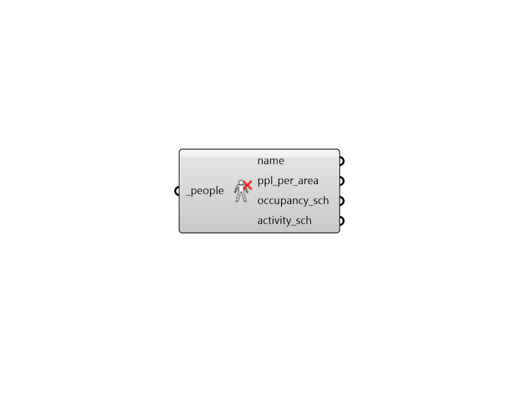

## Deconstruct People

 - [[source code]](https://github.com/ladybug-tools/honeybee-grasshopper-energy/blob/master/honeybee_grasshopper_energy/src//HB%20Deconstruct%20People.py)

Deconstruct a People object into its constituient properties. 

#### Inputs
* ##### people [Required]
A People object to deconstruct. 

#### Outputs
* ##### name
Text string for the people object display name. 
* ##### ppl_per_area
A numerical value for the number of people per square meter of floor area. 
* ##### occupancy_sch
A fractional schedule for the occupancy over the course of the year. The fractional values in this schedule get multiplied by the _people_per_area to yield a complete occupancy profile. 
* ##### activity_sch
A schedule for the activity of the occupants over the course of the year. The type limt of this schedule are "Power" and the values of the schedule equal to the number of Watts given off by an individual person in the room. 