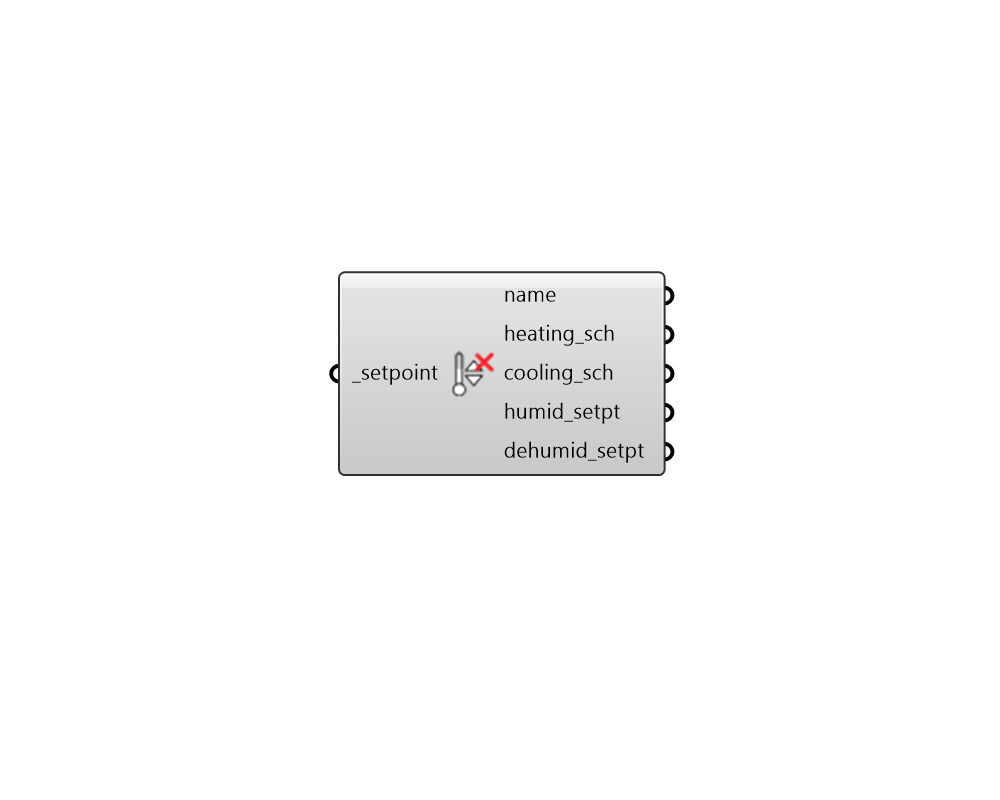

## Deconstruct Setpoint

 - [[source code]](https://github.com/ladybug-tools/honeybee-grasshopper-energy/blob/master/honeybee_grasshopper_energy/src//HB%20Deconstruct%20Setpoint.py)

Deconstruct a Setpoint object into its constituient properties. 

#### Inputs
* ##### setpoint [Required]
A Setpoint object to be deconstructed. 

#### Outputs
* ##### name
Text string for the setpoint display name. 
* ##### heating_sch
A temperature schedule for the heating setpoint. The type limit of this schedule should be temperature and the values should be the temperature setpoint in degrees Celcius. 
* ##### cooling_sch
A temperature schedule for the cooling setpoint. The type limit of this schedule should be temperature and the values should be the temperature setpoint in degrees Celcius. 
* ##### humid_setpt
A numerical value between 0 and 100 for the relative humidity humidifying setpoint [%]. This value will be constant throughout the year. If None, no humidification will occur. 
* ##### dehumid_setpt
A numerical value between 0 and 100 for the relative humidity dehumidifying setpoint [%]. This value will be constant throughout the year. If None, no dehumidification will occur beyond that which is needed to create air at the cooling supply temperature. 