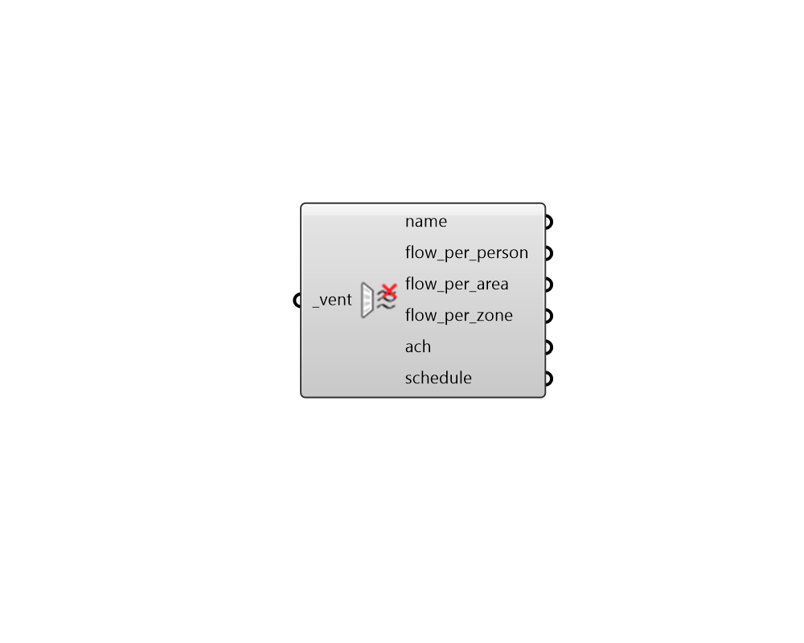

## Deconstruct Ventilation

 - [[source code]](https://github.com/ladybug-tools/honeybee-grasshopper-energy/blob/master/honeybee_grasshopper_energy/src//HB%20Deconstruct%20Ventilation.py)

Deconstruct a Ventilation object into its constituient properties. 

Note the the 4 ventilation types (_flow_per_person_, _flow_per_area_, _flow_per_zone_, _ach_) are ultimately summed together to yeild the ventilation design flow rate used in the simulation. 

#### Inputs
* ##### vent [Required]
An Ventilation object to be deconstructed. 

#### Outputs
* ##### name
Text string for the ventilation display name. 
* ##### flow_per_person
A numerical value for the intensity of ventilation in m3/s per person. Note that setting this value here does not mean that ventilation is varied based on real-time occupancy but rather that the design level of ventilation is determined using this value and the People object of the zone. To vary ventilation in real time, the ventilation schedule should be used. Most ventilation standards support that a value of 0.01 m3/s (10 L/s or ~20 cfm) per person is sufficient to remove odors. 
* ##### flow_per_area
A numerical value for the intensity of ventilation in m3/s per square meter of floor area. 
* ##### flow_per_zone
A numerical value for the design level of ventilation in m3/s for the entire zone. 
* ##### ach
A numberical value for the design level of ventilation in air changes per hour (ACH) for the entire zone. This is particularly helpful for hospitals, where ventilation standards are often given in ACH. 
* ##### schedule
An optional fractional schedule for the ventilation over the course of the year. The fractional values will get multiplied by the total design flow rate (determined from the fields above and the calculation_method) to yield a complete ventilation profile. If None, the design level of ventilation is used throughout all timesteps of the simulation. 