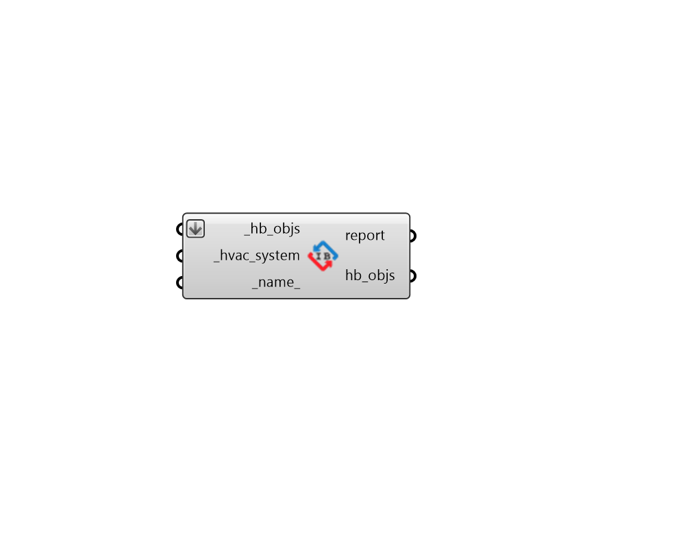

## Detailed HVAC

 - [[source code]](https://github.com/ladybug-tools/honeybee-grasshopper-energy/blob/master/honeybee_grasshopper_energy/src//HB%20Detailed%20HVAC.py)

Apply a detailed Ironbug HVAC to Honeybee Rooms or a Honeybee Model. 

#### Inputs
* ##### hb_objs [Required]
Honeybee Rooms to which the input Ironbug HVAC will be assigned. This can also be a Honeybee Model for which the relevant Rooms referenced in the _hvac_system will be assigned the HVAC system. 
* ##### hvac_system [Required]
A fully-detailed Irongbug HVAC system to be assigned to the input rooms (or model). 
* ##### name 
Text to set the name for the HVAC system and to be incorporated into unique HVAC identifier. If the name is not provided, a random name will be assigned. 

#### Outputs
* ##### report
Reports, errors, warnings, etc. 
* ##### hb_objs
The input Rooms or Model with the detailed HVAC system applied. 