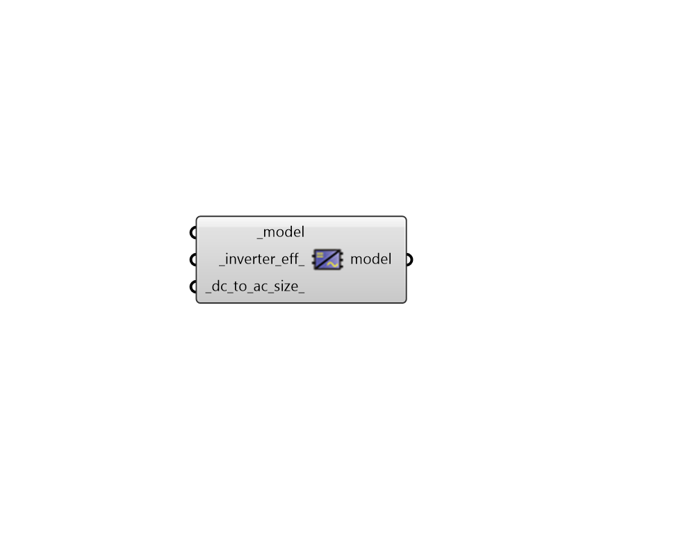

## Electric Load Center

 - [[source code]](https://github.com/ladybug-tools/honeybee-grasshopper-energy/blob/master/honeybee_grasshopper_energy/src//HB%20Electric%20Load%20Center.py)

Set the properites of a Model's electric load center, which governs how on-site electricity generation is converted and distributed. 

#### Inputs
* ##### model [Required]
A Honeybee Model for which the electric load center properties will be set. This Model should include on-site power generation objects, like Shades with PV properties assigned, in order for the inputs here to have an effect on the simulation. 
* ##### inverter_eff 
A number between 0 and 1 for the load centers's inverter nominal rated DC-to-AC conversion efficiency. An inverter converts DC power, such as that output by photovoltaic panels, to AC power, such as that distributed by the electrical grid and is available from standard electrical outlets. Inverter efficiency is defined as the inverter's rated AC power output divided by its rated DC power output. (Default: 0.96). 
* ##### dc_to_ac_size 
A positive number (typically greater than 1) for the ratio of the inverter's DC rated size to its AC rated size. Typically, inverters are not sized to convert the full DC output under standard test conditions (STC) as such conditions rarely occur in reality and therefore unnecessarily add to the size/cost of the inverter. For a system with a high DC to AC size ratio, during times when the DC power output exceeds the inverter's rated DC input size, the inverter limits the array's power output by increasing the DC operating voltage, which moves the arrays operating point down its current-voltage (I-V) curve. The default value of 1.1 is reasonable for most systems. A typical range is 1.1 to 1.25, although some large-scale systems have ratios of as high as 1.5. The optimal value depends on the system's location, array orientation, and module cost. (Default: 1.1). 

#### Outputs
* ##### model
The input Honeybee Model with the electric load center properties set. 