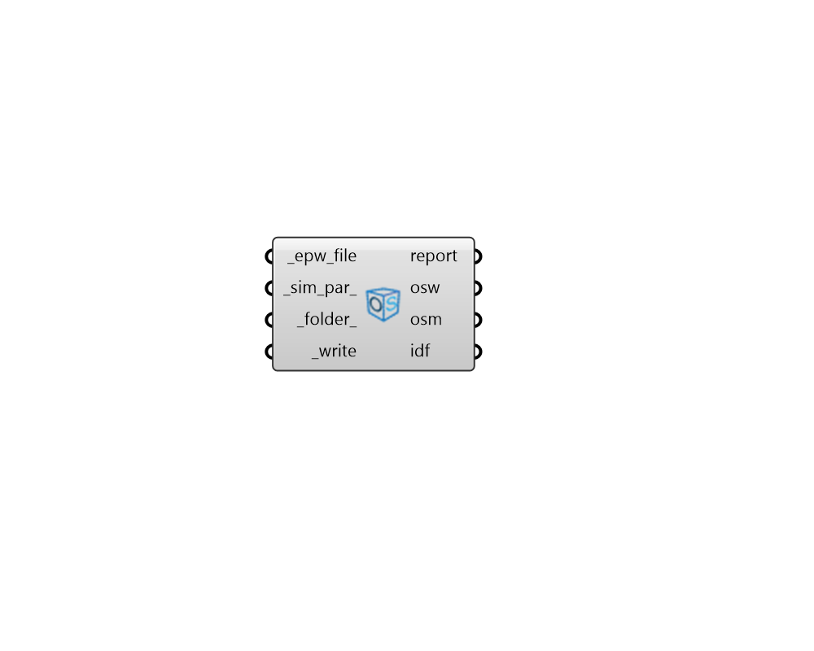

## Empty OSM

 - [[source code]](https://github.com/ladybug-tools/honeybee-grasshopper-energy/blob/master/honeybee_grasshopper_energy/src//HB%20Empty%20OSM.py)

Create an empty OpenStudio Model (OSM) file with no building geometry. 

This is useful as a starting point for OSMs to which detailed Ironbug systems will be added. Such models with only Ironbug HVAC components can simulate in EnergyPlus if they use the LoadProfile:Plant object to represent the building loads. 

They are useful for evaluating the performance of such heating/cooling plants and, by setting the simulation parameters and EPW file with this component, any sizing criteria for the plant components can be set. 

#### Inputs
* ##### epw_file [Required]
Path to an .epw file on this computer as a text string. 
* ##### sim_par 
A honeybee Energy SimulationParameter object that describes all of the setting for the simulation. If None, some default simulation parameters will automatically be used. 
* ##### folder 
An optional folder on this computer, into which the IDF and result files will be written. 
* ##### write [Required]
Set to "True" to create the empty OSM file. 

#### Outputs
* ##### report
Reports, errors, warnings, etc. 
* ##### osw
File path to the OpenStudio Workflow JSON on this machine. This workflow is executed using the OpenStudio command line interface (CLI), which will create the empty OSM following the input simulation parameter specifications. 
* ##### osm
The file path to the empty OpenStudio Model (OSM) that has been generated on this computer. 
* ##### idf
The file path of the empty EnergyPlus Input Data File (IDF) that has been generated on this computer. 