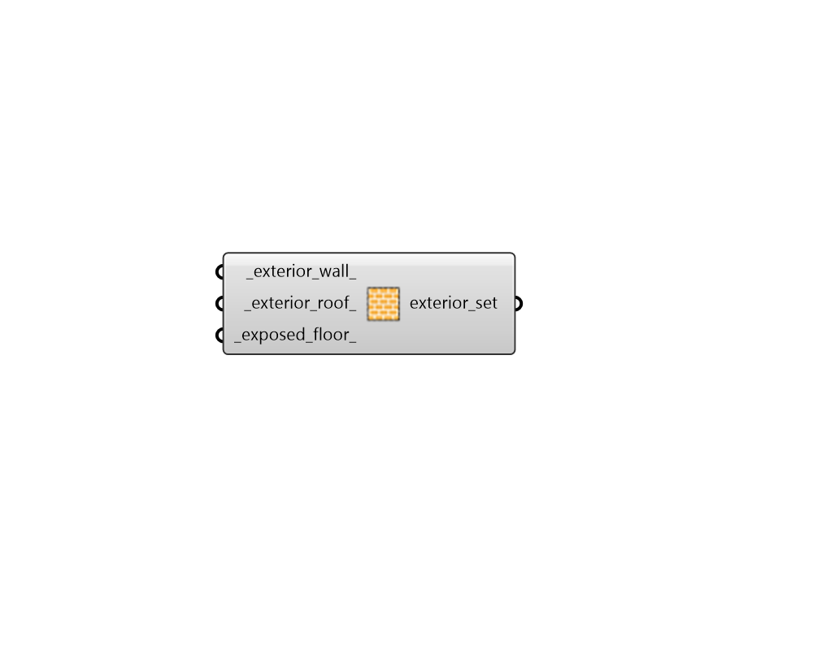

## Exterior Construction Subset

 - [[source code]](https://github.com/ladybug-tools/honeybee-grasshopper-energy/blob/master/honeybee_grasshopper_energy/src//HB%20Exterior%20Construction%20Subset.py)

Create a list of exterior constructions that can be used to edit or create a ConstructionSet object. 

#### Inputs
* ##### exterior_wall 
A construction object for exterior walls (or text for the identifier of the construction within the library). 
* ##### exterior_roof 
A construction object for exterior roofs (or text for the identifier of the construction within the library). 
* ##### exposed_floor 
A construction object for exposed floors (or text for the identifier of the construction within the library). 

#### Outputs
* ##### exterior_set
A list of exterior constructions that can be used to edit or create a ConstructionSet object. 