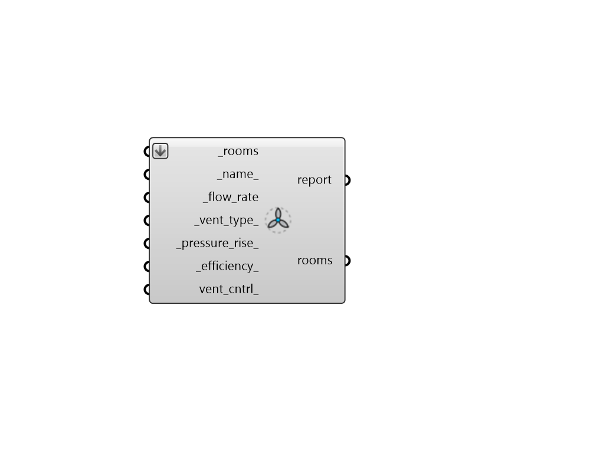

## Fan Ventilation

 - [[source code]](https://github.com/ladybug-tools/honeybee-grasshopper-energy/blob/master/honeybee_grasshopper_energy/src//HB%20Fan%20Ventilation.py)

Add ventilation fans to Rooms. 

This fan is not connected to any heating or cooling system and is meant to represent the intentional circulation of unconditioned outdoor air for the purposes of keeping a space cooler, drier or free of indoor pollutants (as in the case of kitchen or bathroom exhaust fans). 

#### Inputs
* ##### rooms [Required]
Honeybee Rooms to which ventilation fans should be assigned. 
* ##### name 
Text to set the name for the ventilation fan and to be incorporated into a unique ventilation fan identifier. If None, a unique name will be generated. 
* ##### flow_rate [Required]
A positive number for the flow rate of the fan in m3/s. 
* ##### vent_type 
Text to indicate the type of type of ventilation. Choose from the options below. For either Exhaust or Intake, values for fan pressure and efficiency define the fan electric consumption. For Exhaust ventilation, the conditions of the air entering the space are assumed to be equivalent to outside air conditions. For Intake and Balanced ventilation, an appropriate amount of fan heat is added to the entering air stream. For Balanced ventilation, both an intake fan and an exhaust fan are assumed to co-exist, both having the same flow rate and power consumption (using the entered values for fan pressure rise and fan total efficiency). Thus, the fan electric consumption for Balanced ventilation is twice that for the Exhaust or Intake ventilation types which employ only a single fan. (Default: Balanced). 

    * Exhaust

    * Intake

    * Balanced
* ##### pressure_rise 
A number for the the pressure rise across the fan in Pascals (N/m2). This is often a function of the fan speed and the conditions in which the fan is operating since having the fan blow air through filters or narrow ducts will increase the pressure rise that is needed to deliver the input flow rate. The pressure rise plays an important role in determining the amount of energy consumed by the fan. Smaller fans like a 0.05 m3/s desk fan tend to have lower pressure rises around 60 Pa. Larger fans, such as a 6 m3/s fan used for ventilating a large room tend to have higher pressure rises around 400 Pa. The highest pressure rises are typically for large fans blowing air through ducts and filters, which can have pressure rises as high as 1000 Pa. If this input is None, the pressure rise will be estimated from the flow_rate, with higher flow rates corresponding to larger pressure rises (up to 400 Pa). These estimated pressure rises are generally assumed to have minimal obstructions between the fan and the room and they should be increased if the fan is blowing air through ducts or filters. 
* ##### efficiency 
A number between 0 and 1 for the overall efficiency of the fan. Specifically, this is the ratio of the power delivered to the fluid to the electrical input power. It is the product of the fan motor efficiency and the fan impeller efficiency. Fans that have a higher blade diameter and operate at lower speeds with smaller pressure rises for their size tend to have higher efficiencies. Because motor efficiencies are typically between 0.8 and 0.9, the best overall fan efficiencies tend to be around 0.7 with most typical fan efficiencies between 0.5 and 0.7. The lowest efficiencies often happen for small fans in situations with high pressure rises for their size, which can result in efficiencies as low as 0.15. If None, this input will be estimated from the fan flow rate and pressure rise with large fans operating at low pressure rises for their size having up to 0.7 efficiency and small fans operating at high pressure rises for their size having as low as 0.15 efficiency. 
* ##### vent_cntrl 
A Ventilation Control object from the "HB Ventilation Control" component that dictates the conditions under which the fan is turned on. If None, the fan on all of the time. 

#### Outputs
* ##### report
Reports, errors, warnings, etc. 
* ##### rooms
The input Rooms with ventilation fans assigned to them. 