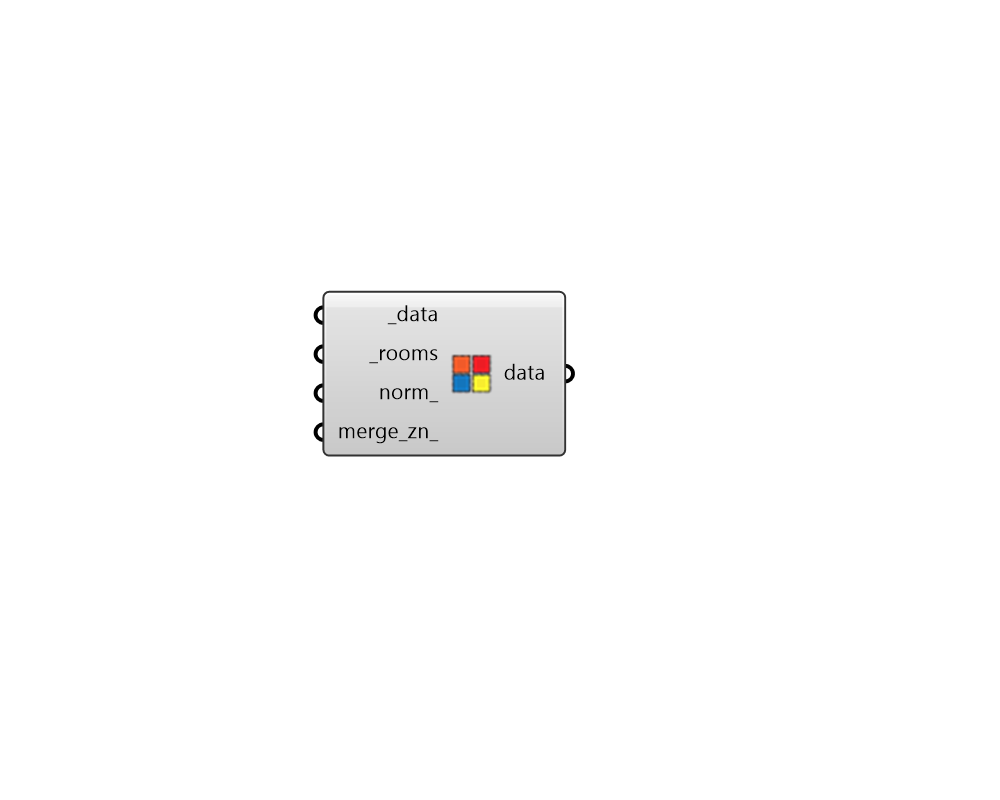

## Filter Room Result

 - [[source code]](https://github.com/ladybug-tools/honeybee-grasshopper-energy/blob/master/honeybee_grasshopper_energy/src//HB%20Filter%20Room%20Result.py)

Filter data collections of energy simulation results using a list of Rooms to which the simulations relate. 

This can be used in combination with components like "HB Rooms by Attribute" to get simulation resutls for subset of rooms (eg. all of the offices). 

#### Inputs
* ##### data [Required]
A list of data collections output from an energy simulation, which will be filtered based on the input _rooms. Data collections can be of any class (eg. MonthlyCollection, DailyCollection) but they should originate from an energy simulation sql (with header metadata that has 'Zone' or 'System' keys). These keys will be used to match the data in the collections to the input rooms. 
* ##### rooms [Required]
Honeybee Rooms, which will be matched with the input _data. This can also be an enitre Model. 
* ##### norm 
Boolean to note whether results should be normalized by the Room floor area if the data type of the data_colections supports it. (Default: False) 
* ##### merge_zn 
Boolean to note whether the output data should include one data collection per room with the output aligned with input rooms (False) OR duplicate data collections for rooms belonging to the same zone should be merged (True). (Default: False). 

#### Outputs
* ##### data
The input _data filtered by the connected _rooms (and optionally normalized by the floor area of each individual room). 