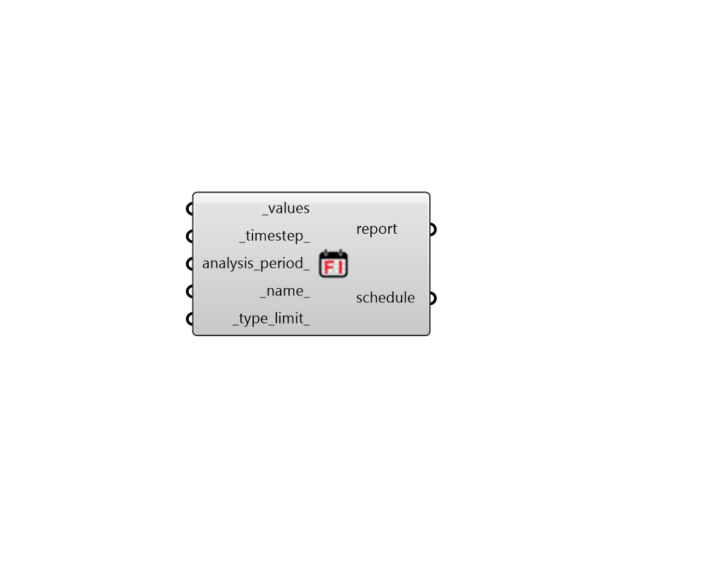

## Fixed Interval Schedule

 - [[source code]](https://github.com/ladybug-tools/honeybee-grasshopper-energy/blob/master/honeybee_grasshopper_energy/src//HB%20Fixed%20Interval%20Schedule.py)

Create a schedule defined by a list of values at a fixed interval or timestep running over the entirety of the simulation period. 

#### Inputs
* ##### values [Required]
A list of timeseries values occuring at a fixed timestep over the entire simulation. Typically, this should be a list of 8760 values for each hour of the year but it can be a shorter list if you don't plan on using the schedule in an annual simulation. In this case, the analysis_period_ should probably be different than the default. This list can also have a length much greater than 8760 if a timestep greater than 1 is used. 
* ##### timestep 
An integer for the number of steps per hour that the input values correspond to.  For example, if each value represents 30 minutes, the timestep is 2. For 15 minutes, it is 4. Default is 1, meaning each value represents a single hour. Must be one of the 
* ##### analysis_period 
A ladybug AnalysisPeriod object to note when the input values take effect. Default is for the whole year. Note that this default usually should not be changed unless you plan to run a simulation that is much shorter than a year. 
* ##### name 
Text to set the name for the Schedule and to be incorporated into a unique Schedule identifier. 
* ##### type_limit 
A text string from the name of the ScheduleTypeLimit to be looked up in the schedule type limit library. This can also be a custom ScheduleTypeLimit object from the "HB Type Limit" component. The input here will be used to validate schedule values against upper/lower limits and assign units to the schedule values. Default: "Fractional" for values that range continuously between 0 and 1. Choose from the following built-in options: 

    * Fractional

    * On-Off

    * Temperature

    * Activity Level

    * Power

    * Humidity

    * Angle

    * Delta Temperature

#### Outputs
* ##### report
Reports, errors, warnings, etc. 
* ##### schedule
A ScheduleRuleset object that can be assigned to a Room, a Load object, or a ProgramType object. 