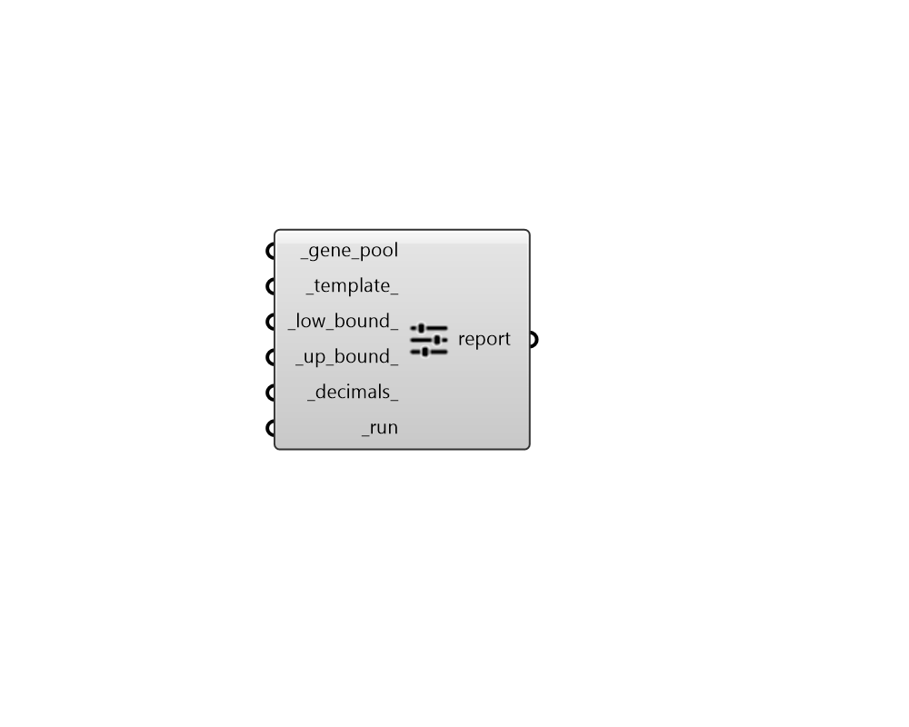

## Gene Pool to Day Schedule

 - [[source code]](https://github.com/ladybug-tools/honeybee-grasshopper-energy/blob/master/honeybee_grasshopper_energy/src//HB%20Gene%20Pool%20to%20Day%20Schedule.py)

Modify a native Grasshopper Gene Pool component into a format that makes it easy to input daily schedules into the other schedule components. 

This essentially turns the Gene Pool into a list of 24 sliders representing an hourly timeseries over a day. Each slider runs from the _low_bound_ to _high_bound_. 

#### Inputs
* ##### gene_pool [Required]
The output of a native Grasshopper Gene Pool component. 
* ##### template 
An integer for the template for which the values of the gene pool will be set. Default: 0. Choose one of the templates: 
0 - maximum values from 9:00 to 17:00 1 - minimum values from 9:00 to 17:00 2 - maximum values from 7:00 to 22:00 3 - minimum values from 7:00 to 22:00 4 - maximum values from 0:00 to 24:00 5 - minimum values from 0:00 to 24:00 
* ##### low_bound 
A number for the lower boundary of the schedule values. 
* ##### up_bound 
A number for the upper boundary of the schedule range. 
* ##### decimals 
An integer greater than or equal to 0 for the number of decimal places to use in each slider. Default: 1. 
* ##### run [Required]
Set to "True" to run the component and modify the connected gene pool. Note that you on't be able to edit a connected gene pool while this input is set to "True". 

#### Outputs
* ##### report
Reports, errors, warnings, etc. 