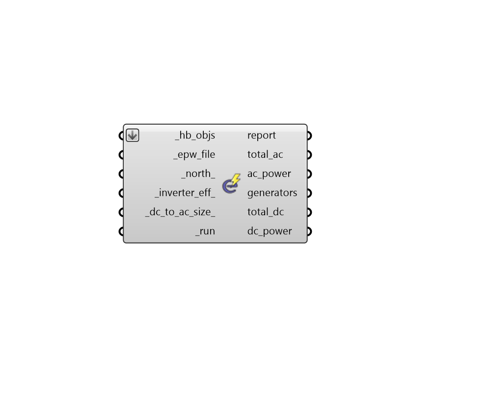

## Generation Loads

 - [[source code]](https://github.com/ladybug-tools/honeybee-grasshopper-energy/blob/master/honeybee_grasshopper_energy/src//HB%20Generation%20Loads.py)

Run Honeybee objects capable of generating electricity (such as Shades with PV properties) through a quick energy simulation to obtain an estimate of electricity production. 

Note that this component only evaluates electricity production and not energy consumption. Any number of Honeybee Rooms or other objects can be connected but they will only be simulated as context shade that casts shadows on the generator objects. 

#### Inputs
* ##### hb_objs [Required]
An array of honeybee Rooms, Faces, Apertures, Doors or Shades to be included in the simulation of electricity production. This can also be an entire Model to be simulated. Any number of Honeybee Rooms or non-generating objects can be connected but they will only be simulated as context shade that casts shadows on the generator objects. 
* ##### epw_file [Required]
Path to an .epw file on your system as a text string. 
* ##### north 
A number between -360 and 360 for the counterclockwise difference between the North and the positive Y-axis in degrees. 90 is West and 270 is East. (Default: 0). 
* ##### inverter_eff 
A number between 0 and 1 for the load centers's inverter nominal rated DC-to-AC conversion efficiency. An inverter converts DC power, such as that output by photovoltaic panels, to AC power, such as that distributed by the electrical grid and is available from standard electrical outlets. Inverter efficiency is defined as the inverter's rated AC power output divided by its rated DC power output. (Default: 0.96). 
* ##### dc_to_ac_size 
A positive number (typically greater than 1) for the ratio of the inverter's DC rated size to its AC rated size. Typically, inverters are not sized to convert the full DC output under standard test conditions (STC) as such conditions rarely occur in reality and therefore unnecessarily add to the size/cost of the inverter. For a system with a high DC to AC size ratio, during times when the DC power output exceeds the inverter's rated DC input size, the inverter limits the array's power output by increasing the DC operating voltage, which moves the arrays operating point down its current-voltage (I-V) curve. The default value of 1.1 is reasonable for most systems. A typical range is 1.1 to 1.25, although some large-scale systems have ratios of as high as 1.5. The optimal value depends on the system's location, array orientation, and module cost. (Default: 1.1). 
* ##### run [Required]
Set to "True" to run the simulation to obtain annual loads. This can also be the integer 2 to run the simulation while being able to see the simulation process (with a batch window). 

#### Outputs
* ##### report
A report of the energy simulation run. 
* ##### total_ac
A number for the total on-site produced alternating current (AC) electricity in kWh. 
* ##### ac_power
A data collection of all on-site produced electricity (kWh). This represents the alternating current (AC) electricity coming out of the inverter that processes all on-site power production. 
* ##### generators
A list of names for each of the electricity generation objects that were found among the connected _hb_objs. These names align with the tota_dc output below as well as the dc_power data collections. 
* ##### total_dc
A list of numbers for the direct current (DC) electricity produced by each generator object in kWh. 
* ##### dc_power
A list of data collections for the direct current (DC) electricity produced by each on-site electricity generator (kWh). Each photovoltaic object will have a separate data collection. 