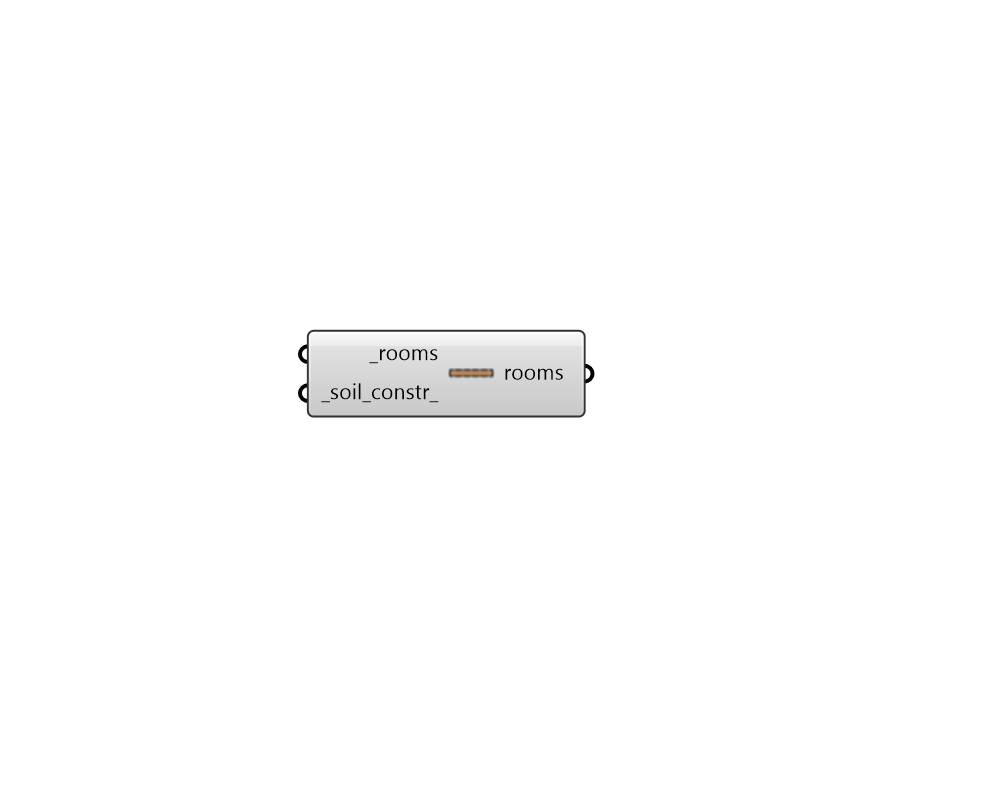

## Ground

 - [[source code]](https://github.com/ladybug-tools/honeybee-grasshopper-energy/blob/master/honeybee_grasshopper_energy/src//HB%20Ground.py)

Change the properties of Honeybee Rooms to reflect those of a ground surface. 

This is particularly useful for setting up outdoor thermal comfort maps that account for the surface temperature of the ground. Modeling the ground as a room this way will ensure that shadows other objects cast upon it are accounted for along with the storage of heat in the ground surface. 

The turning of a Room into a ground entails: 

* Setting all constructions to be indicative of a certain soil type. * Setting all Faces except the roof to have a Ground boundary condition. * Removing all loads and schedules assigned to the Room. 

All values for the typical soil_types are taken from the Engineering Toolbox, specifically these pages: Soil Conductivity - http://www.engineeringtoolbox.com/thermal-conductivity-d_429.html Soil Density - http://www.engineeringtoolbox.com/dirt-mud-densities-d_1727.html Soil Heat Capacity - http://www.engineeringtoolbox.com/specific-heat-capacity-d_391.html 

#### Inputs
* ##### rooms [Required]
Honeybee Rooms to be converted into ground objects. 
* ##### soil_constr 
An OpaqueConstruction that reflects the soil type of the ground. This can also be text for a construction to be looked up in the opaque construction library. If a multi-layered construction is input, the multiple layers will only be used for the roof Face of the Room and all other Faces will get a construction with the inner-most layer assigned. Some common types of soil constructions contained in the default honeybee standards library are listed below. (Default: Concrete Pavement). 
Grassy Lawn Dry Sand Dry Dust Moist Soil Mud Concrete Pavement Asphalt Pavement Solid Rock 

#### Outputs
* ##### rooms
Rooms that have had their properties altered to be representative of ground conditions. 