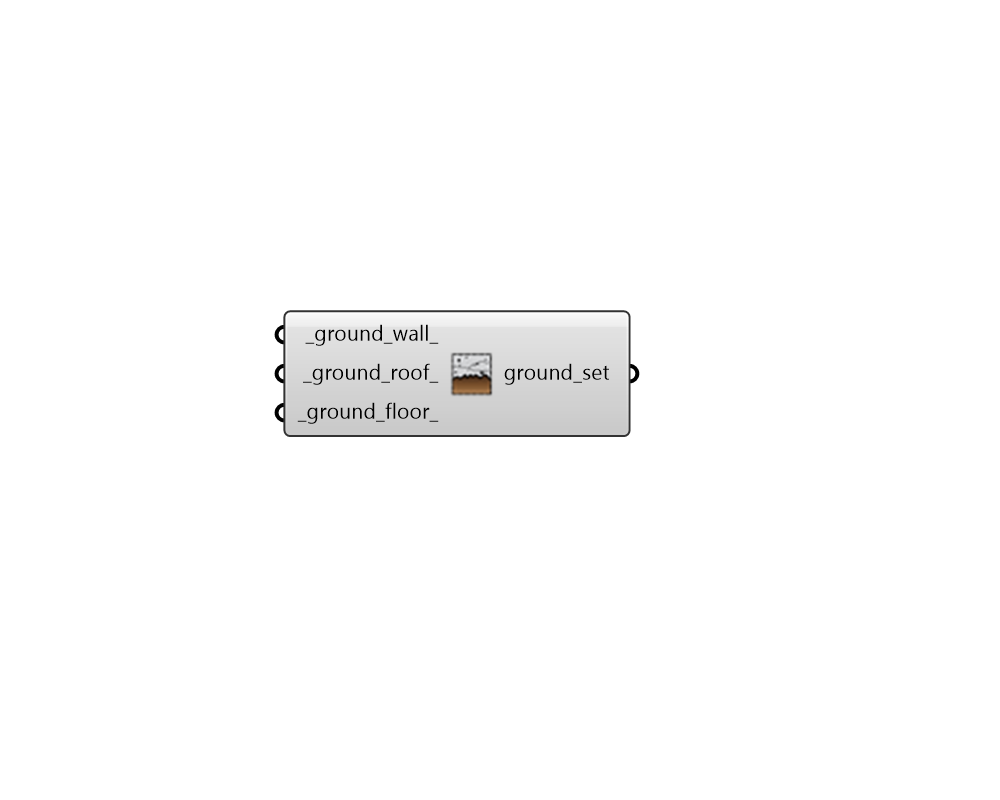

## Ground Construction Subset

 - [[source code]](https://github.com/ladybug-tools/honeybee-grasshopper-energy/blob/master/honeybee_grasshopper_energy/src//HB%20Ground%20Construction%20Subset.py)

Create a list of ground constructions that can be used to edit or create a ConstructionSet object. 

#### Inputs
* ##### ground_wall 
A construction object for underground walls (or text for the identifier of the construction within the library). 
* ##### ground_roof 
A construction object for underground roofs (or text for the identifier of the construction within the library). 
* ##### ground_floor 
A construction object for ground-contact floors (or text for the identifier of the construction within the library). 

#### Outputs
* ##### ground_set
A list of ground constructions that can be used to edit or create a ConstructionSet object. 