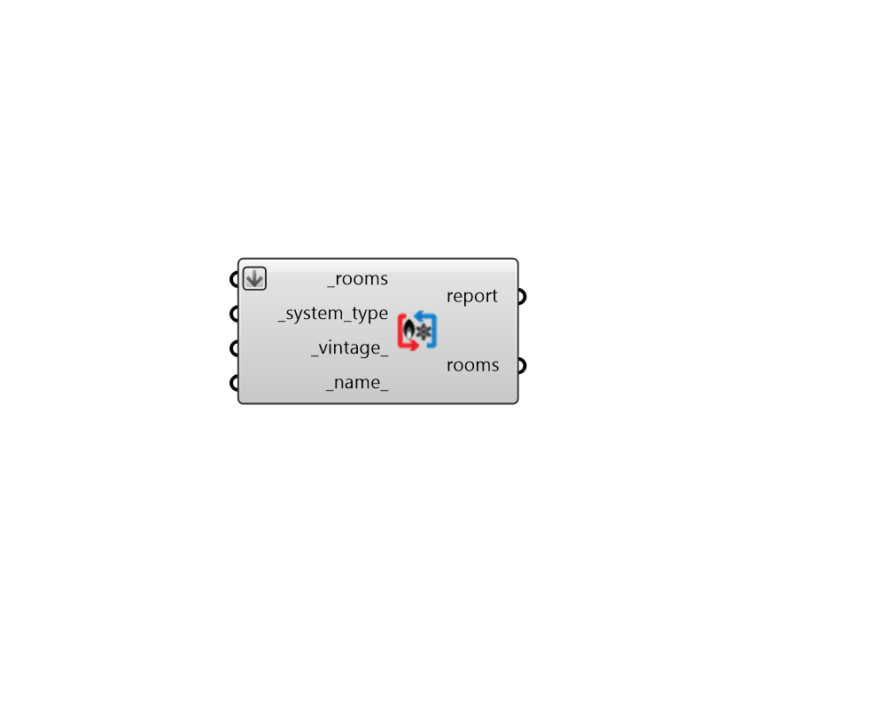

## HeatCool HVAC

 - [[source code]](https://github.com/ladybug-tools/honeybee-grasshopper-energy/blob/master/honeybee_grasshopper_energy/src//HB%20HeatCool%20HVAC.py)

Apply a template system that only supplies heating and/or cooling (no ventilation) to Honeybee Rooms. 

These systems are only designed to satisfy heating + cooling demand and they cannot meet any minimum ventilation requirements. 

As such, these systems tend to be used in residential or storage settings where meeting minimum ventilation requirements may not be required or the density of occupancy is so low that infiltration is enough to meet fresh air demand. 

#### Inputs
* ##### rooms [Required]
Honeybee Rooms to which the input template system will be assigned. This can also be a Honeybee Model for which all conditioned Rooms will be assigned the HVAC system. 
* ##### system_type [Required]
Text for the specific type of heating/cooling system and equipment. The "HB HeatCool HVAC Templates" component has a full list of the supported Heating/Cooling system templates. 
* ##### vintage 
Text for the vintage of the template system. This will be used to set efficiencies for various pieces of equipment within the system. The "HB Building Vintages" component has a full list of supported HVAC vintages. (Default: ASHRAE_2019). 
* ##### name 
Text to set the name for the heating/cooling system and to be incorporated into unique system identifier. If the name is not provided, a random name will be assigned. 

#### Outputs
* ##### report
Reports, errors, warnings, etc. 
* ##### rooms
The input Rooms with a heating/cooling system applied. 