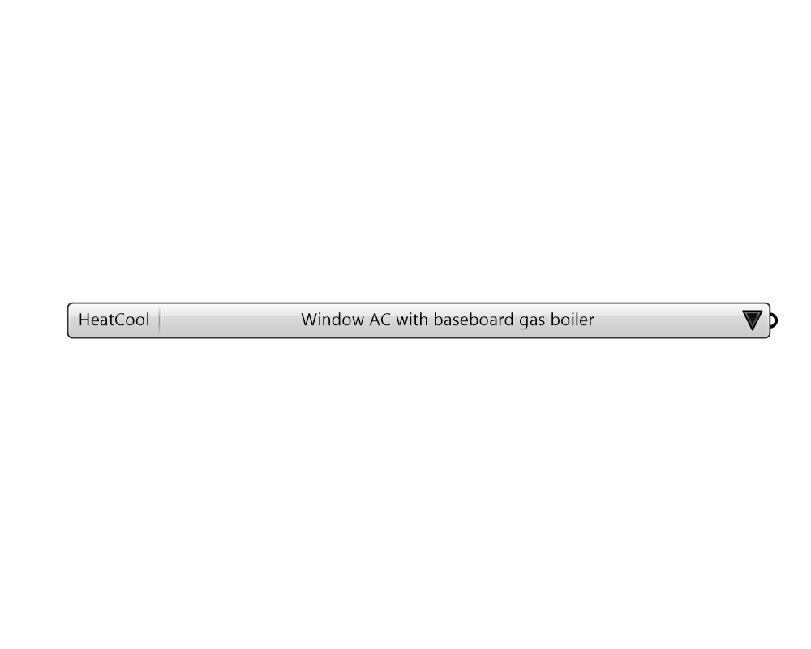

## HeatCool HVAC Templates

 - [[source code]](https://github.com/ladybug-tools/honeybee-grasshopper-energy/blob/master/honeybee_grasshopper_energy/src//HB%20HeatCool%20HVAC%20Templates.py)

Provides a list of available template systems providing heating + cooling (without ventilation). 