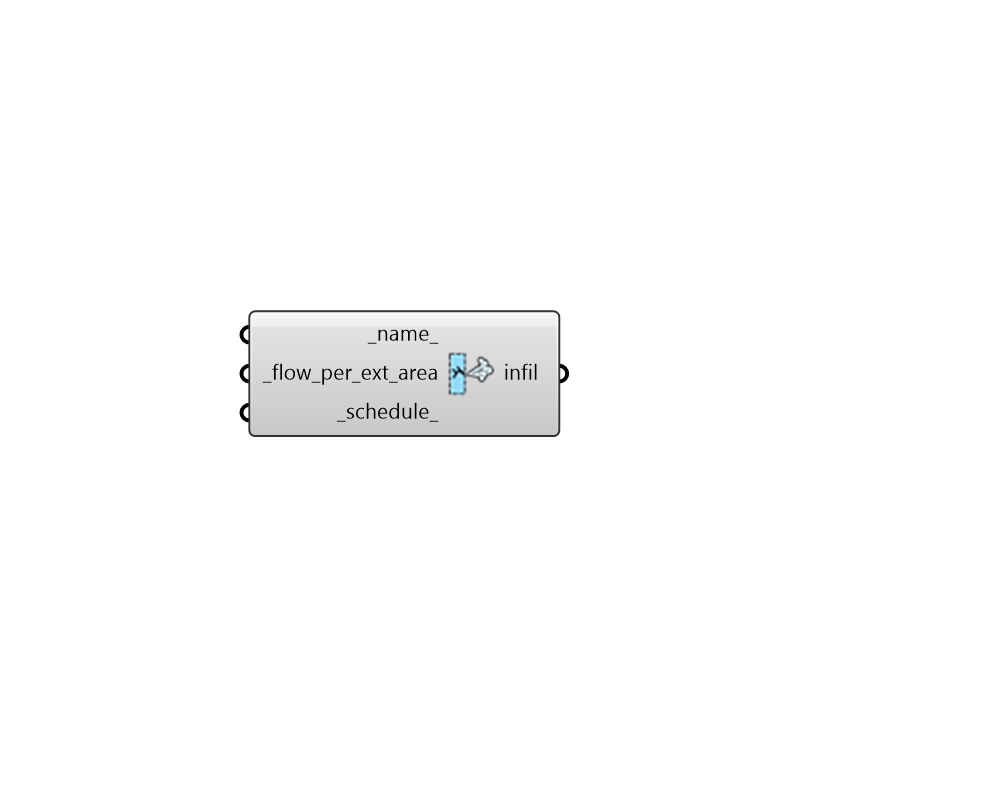

## Infiltration

 - [[source code]](https://github.com/ladybug-tools/honeybee-grasshopper-energy/blob/master/honeybee_grasshopper_energy/src//HB%20Infiltration.py)

Create an Infiltration object that can be used to create a ProgramType or be assigned directly to a Room. 

#### Inputs
* ##### name 
Text to set the name for the Infiltration and to be incorporated into a unique Infiltration identifier. If None, a unique name will be generated. 
* ##### flow_per_ext_area [Required]
A numerical value for the intensity of infiltration in m3/s per square meter of exterior surface area. Typical values for this property are as follows (note all values are at typical building pressures of ~4 Pa): 

    * 0.0001 (m3/s per m2 facade) - Tight building

    * 0.0003 (m3/s per m2 facade) - Average building

    * 0.0006 (m3/s per m2 facade) - Leaky building
* ##### schedule 
A fractional schedule for the infiltration over the course of the year. The fractional values will get multiplied by the flow_per_exterior_area to yield a complete infiltration profile. 

#### Outputs
* ##### infil
An Infiltration object that can be used to create a ProgramType or be assigned directly to a Room. 