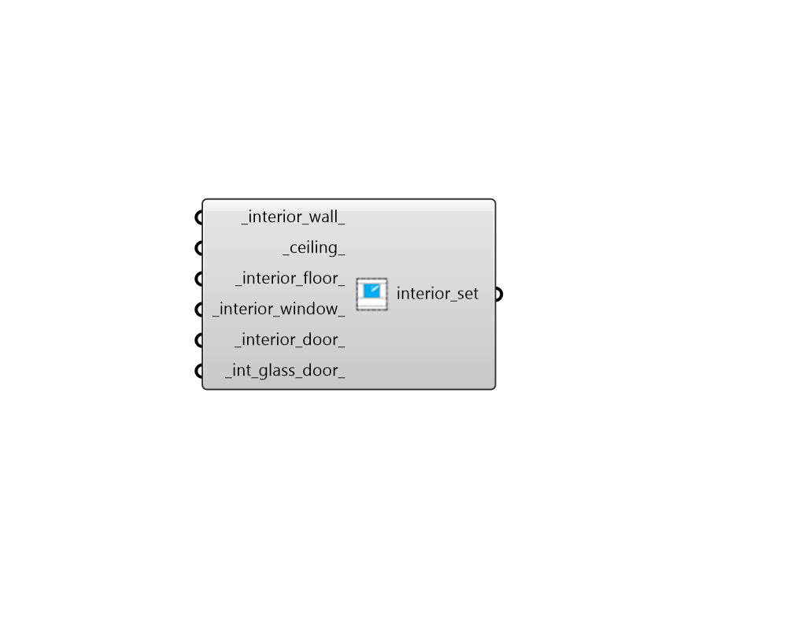

## Interior Construction Subset

 - [[source code]](https://github.com/ladybug-tools/honeybee-grasshopper-energy/blob/master/honeybee_grasshopper_energy/src//HB%20Interior%20Construction%20Subset.py)

Create a list of interior constructions that can be used to edit or create a ConstructionSet object. 

#### Inputs
* ##### interior_wall 
A construction object for interior walls (or text for the identifier of the construction within the library). 
* ##### ceiling 
A construction object for ceilings (or text for the identifier of the construction within the library). 
* ##### interior_floor 
A construction object for interior floors (or text for the identifier of the construction within the library). 
* ##### interior_window 
A construction object for all apertures with a Surface boundary condition. This can also be text for the identifier of the construction within the library. 
* ##### interior_door 
A construction object for all opaque doors with a Surface boundary condition. This can also be text for the identifier of the construction within the library. 
* ##### int_glass_door 
A construction object for all glass doors with a Surface boundary condition. This can also be text for the identifier of the construction within the library. 

#### Outputs
* ##### interior_set
A list of interior constructions that can be used to edit or create a ConstructionSet object. 