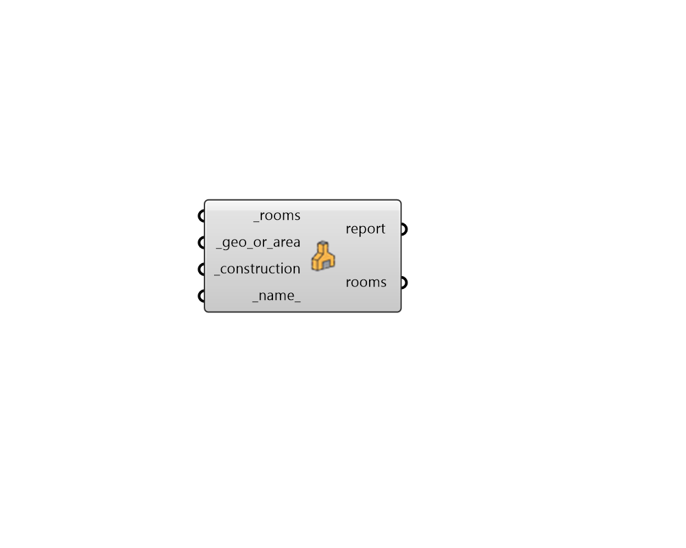

## Internal Mass

 - [[source code]](https://github.com/ladybug-tools/honeybee-grasshopper-energy/blob/master/honeybee_grasshopper_energy/src//HB%20Internal%20Mass.py)

Assign internal thermal masses to Rooms, which can be used to account for the effects of furniture inside Rooms or other massive building components like staircases, hearths, etc. 

The component accepts either Rhino geometry (representing furniture or massive elements) or a numerical value of the mass's surface area. Several of these components can be used in a series to descibe different internal masses made of different materials. 

Note that internal masses assigned this way cannot "see" solar radiation that may potentially hit them and, as such, caution should be taken when using this component with internal mass objects that are not always in shade. Masses are factored into the the thermal calculations of the Room by undergoing heat transfer with the indoor air. 

#### Inputs
* ##### rooms [Required]
Honeybee Rooms to which internal masses should be assigned. 
* ##### geo_or_area [Required]
A list of Rhino breps or meshes representing the surfaces of internal masses that are exposed to the air of the Room. Alternatively, this can be a number or list of numbers representing the surface area of the internal masses (in square meters) that are exposed to the Room air. 
In the case of Rhino geometry representing the surfaces of internal masses, this component will determine which Room the geometry is in. However, geometry must lie COMPLETELY inside a single Room and cannot span between Rooms or span outside the building. If a geometry lies between two Rooms, it should be split in two along the boundary between the Rooms. Also note that geometries are assumed to have only one side exposed to the Room air so, if they are meant to represent a 2-sided object, the geometry should be duplicated and offset. 
In the case of numbers representing the the surface area of the internal masses, inputs can be either a single number (which will be used to put internal masses into all Rooms using the specified surface area), or it can be a list of numbers that matches the input Rooms, which can be used to assign different amounts of mass surface area to different Rooms. All numbers are assumed to be in square meters. 
* ##### construction [Required]
An OpaqueConstruction object that represents the material that the internal thermal mass is composed of. This can also be text for the identifier of the construction within the library. 
* ##### name 
An optional text name for the internal mass. This can be useful for keeping track of different internal masses when using several of these components in series. If unspecified, a unique one will be generated. 

#### Outputs
* ##### report
Reports, errors, warnings, etc. 
* ##### rooms
The input Rooms with internal masses assigned. 