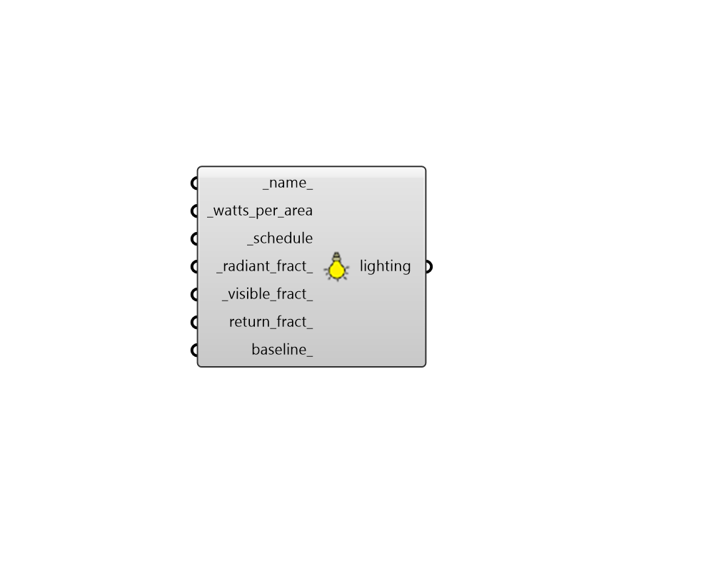
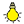

## Lighting

 - [[source code]](https://github.com/ladybug-tools/honeybee-grasshopper-energy/blob/master/honeybee_grasshopper_energy/src//HB%20Lighting.py)

Create a Lighting object that can be used to create a ProgramType or be assigned directly to a Room. 

#### Inputs
* ##### name 
Text to set the name for the Lighting and to be incorporated into a unique Lighting identifier. If None, a unique name will be generated. 
* ##### watts_per_area [Required]
A numerical value for the lighting power density in Watts per square meter of floor area. 
* ##### schedule [Required]
A fractional for the use of lights over the course of the year. The fractional values will get multiplied by the _watts_per_area to yield a complete lighting profile. 
* ##### radiant_fract 
A number between 0 and 1 for the fraction of the total lighting load given off as long wave radiant heat. 
* ##### visible_fract 
A number between 0 and 1 for the fraction of the total lighting load given off as short wave visible light. 
* ##### return_fract 
A number between 0 and 1 for the fraction of the total lighting load that goes into the zone return air (into the zone outlet node). Default: 0.0 (representative of pendant lighting). 
* ##### baseline 
An optional number for the baseline lighting power density in W/m2 of floor area. This baseline is useful to track how much better the installed lights are in comparison to a standard like ASHRAE 90.1. If set to None, it will default to 11.84029 W/m2, which is that ASHRAE 90.1-2004 baseline for an office. 

#### Outputs
* ##### lighting
A Lighting object that can be used to create a ProgramType or be assigned directly to a Room. 