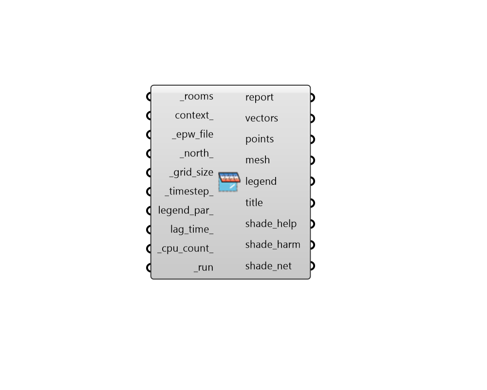

## Load Shade Benefit

 - [[source code]](https://github.com/ladybug-tools/honeybee-grasshopper-energy/blob/master/honeybee_grasshopper_energy/src//HB%20Load%20Shade%20Benefit.py)

Visualize the desirability of shade in terms of its impact on the annual heating and cooling loads of Honeybee Rooms. 

The calculation runs by performing a simple fast energy simulation of the connected Honeybee Rooms without any shade other than context. The resulting heating/cooling loads are extracted at each timestep of the simulation along with the direct (beam) solar gain through each of the Room's windows. Solar vectors are generated for each step of the simulation and projected from the Room's Aperture geometries through the shades assigned to those Apertures. 

Solar vectors for timesteps when the Room is cooling mode contribute positively to shade desirability (shade help) while solar vectors for hours when the Room is heating mode contribute negatively (shade harm). This contribution is weighted by how much cooling or heating energy the Room requires at the timestep along with the direct solar gain through each Aperture at the timestep. 

The component outputs a colored mesh of the shades assigned to the Room Apertures illustrating the net effect of shading each part of the geometry. A higher saturation of blue indicates that shading the cell is desirable. A higher saturation of red indicates that shading the cell is harmful (blocking more sun when the Room is in heating mode than cooling mode). Desaturated cells indicate that shading the cell will have relatively little effect on the heating or cooling loads of the Room. 

The units for shade desirability are kWh of Room cooling load avoided per unit area of shade if the test cell of the shade is helpful (blue). If the test cell is harmful (red), the units are kWh of Room heating load increased per unit area of shade. So, if a given square meter of input _shade_geo has a shad desirability of 10 kWh/m2, this means that a shade in this location provides roughly 10 kWh of avoided cooling load to the parent Room over the year. 

The method used by this component is based off of the Shaderade method developed by Jon Sargent, Jeffrey Niemasz and Christoph Reinhart. More information can be found in the following publication document: Sargent, Jon; Niemasz, Jeffrey; Reinhart, Christoph. SHADERADE: Combining Rhinoceros and EnergyPlus for the Design of Static Exterior Shading Devices. Building Simulation, 2011, Sydney, Australia. http://www.ibpsa.org/proceedings/bs2011/p_1209.pdf 

#### Inputs
* ##### rooms [Required]
A list of Honeybee Rooms for which cooling/heating shade benefit/harm will be evaluated. At least some of these Rooms should have Apertures with Shades assigned to them in order for this component to produce meaningful results. Note that all Shades generated with the "HB Louver Shades" component or the "HB Extruded Border" component are automatically assigned to a parent Aperture. For more complex Shade geometries, the "HB Add Shade" component can be used to assign the Shade to a parent Aperture. 
* ##### context 
Honeybee Shades representing context geometry that can block sun to the _rooms, therefore discounting any benefit or harm that could come to the Room's Shades. 
* ##### epw_file [Required]
Path to an .epw file on your system as a text string. This will be used in the energy simulation to determine heating/cooling loads and to generate solar vectors for the shade benefit calculation. 
* ##### north 
A number between -360 and 360 for the counterclockwise difference between the North and the positive Y-axis in degrees. 90 is West and 270 is East. (Default: 0). 
* ##### grid_size [Required]
A positive number in Rhino model units for the size of grid cells at which the Shade geometries of the input _rooms will be subdivided for shade benefit analysis. The smaller the grid size, the higher the resolution of the analysis and the longer the calculation will take. So it is recommended that one start with a large value here and decrease the value as needed. However, the grid size should usually be smaller than the dimensions of the smallest piece of Shade geometry in order to yield meaningful results. 
* ##### timestep 
An integer for the number of timesteps per hour at which the energy simulation will run and sun vectors will be generated for the analysis. Higher values will result in the generation of more vectors, which will make the resulting shade meshes smoother and produce a better representation of real benefit/harm. However, the calculation will take longer as there are more intersection operations to perform. The default is 1 timestep per hour, which is the coarsest resolution avalable and the fastest calculation. 
* ##### legend_par 
Optional legend parameters from the "LB Legend Parameters" that will be used to customize the display of the results. 
* ##### lag_time 
A number for the amount of time in hours between when solar gain eneters the room and the gain results in an increased cooling load. Typically, it takes an hour or so for solar gains falling on the room floors to heat up the floor surface and then convect to the room air where the gain can be absorbed by a cooling system. This means that the cooling value associated with each sun vector should be a step or two after the time of the sun vector. Lag time can be longer than an hour if the room has a particularly high thermal mass or it may be shorter if the room has less mass or uses a radiant cooling system integrated into the floor where the sun is absorbed. Note that the value input here can be a decimal value to indicate that the lag time is a fraction of an hour. (Default: 1.0 hour). 
* ##### cpu_count 
An integer to set the number of CPUs used in the execution of the intersection calculation. If unspecified, it will automatically default to one less than the number of CPUs currently available on the machine or 1 if only one processor is available. 
* ##### run [Required]
Set to "True" to run the component and perform shade benefit analysis. 

#### Outputs
* ##### report
... 
* ##### vectors
The sun vectors that were used to evaluate the shade (note that these will increase as the _timestep_ increases). 
* ##### points
Points across the room Aperture geometry from which sun vectors are projected. Note that only Apertures with assigned Shades are evaluated in order to avoid unnessarily increasing the calculation time by evaluating windows for which there is not shade. 
* ##### mesh
A colored mesh of the Shades assigned to the room's apertures showing where shading is helpful (blue), harmful (red), or does not make much of a difference (white or desaturated colors). Note that the colors can change depending upon the input legend_par_. 
* ##### legend
Legend showing the numeric values of kWh per unit shade area of decreased/increased cooling/heating load that correspond to the colors in the shade mesh. 
* ##### title
A text object for the study title. 
* ##### shade_help
The cumulative kWh of avoided cooling load per square area unit obtained by shading the given cell. If a given square meter of shade geometry has a helpfulness of 10 kWh/m2, this means that a shade in this location decreases the cooling load of the Room by roughly 10 kWh over the year. 
* ##### shade_harm
The cumulative kWh of increased heating load per square area unit obtained by shading the given cell. If a given square meter of shade geometry has a harmfulness of -10 kWh/m2, this means that a shade in this location increases the heating load of the Room by roughly 10 kWh over the year. 
* ##### shade_net
The sum of the helpfulness and harmfulness for each cell. This will be negative if shading the cell has a net harmful effect and positive if the shade has a net helpful effect. 