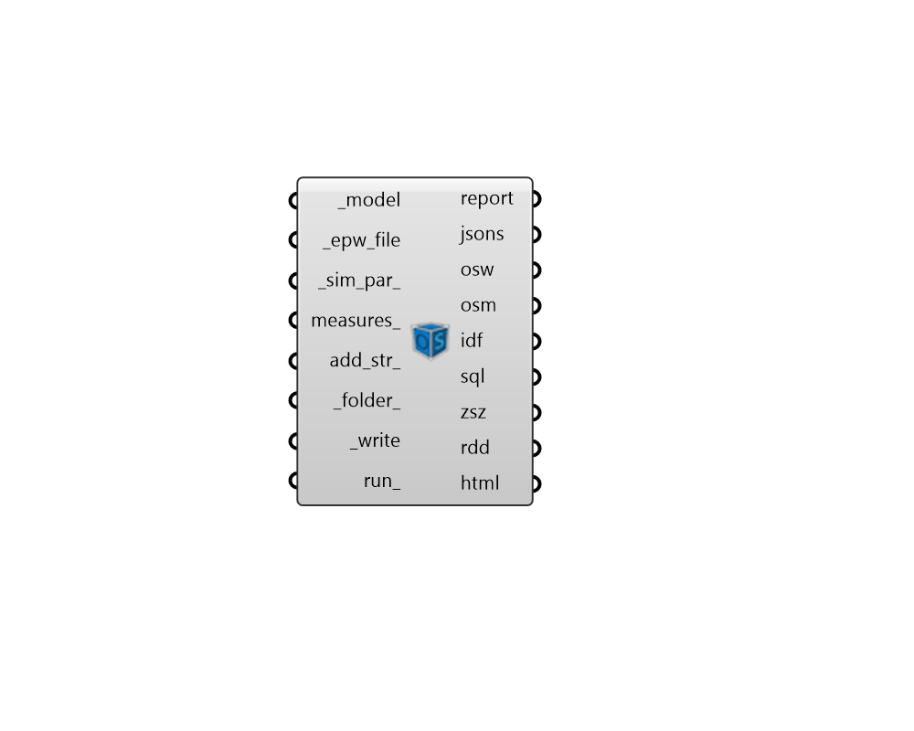

## Model to OSM

 - [[source code]](https://github.com/ladybug-tools/honeybee-grasshopper-energy/blob/master/honeybee_grasshopper_energy/src//HB%20Model%20to%20OSM.py)

Write a honeybee Model to an OSM file (OpenStudio Model), which can then be translated to an IDF file and then run through EnergyPlus. 

#### Inputs
* ##### model [Required]
A honeybee model object possessing all geometry and corresponding energy simulation properties. 
* ##### epw_file [Required]
Path to an .epw file on this computer as a text string. 
* ##### sim_par 
A honeybee Energy SimulationParameter object that describes all of the setting for the simulation. If None, some default simulation parameters will automatically be used. 
* ##### measures 
An optional list of measures to apply to the OpenStudio model upon export. Use the "HB Load Measure" component to load a measure into Grasshopper and assign input arguments. Measures can be downloaded from the NREL Building Components Library (BCL) at 
* ##### add_str 
THIS OPTION IS JUST FOR ADVANCED USERS OF ENERGYPLUS. You can input additional text strings here that you would like written into the IDF.  The input here should be complete EnergyPlus objects as a single string following the IDF format. This input can be used to write objects into the IDF that are not currently supported by Honeybee. 
* ##### folder 
An optional folder on this computer, into which the IDF and result files will be written. 
* ##### write [Required]
Set to "True" to write out the honeybee jsons (containing the Honeybee Model and Simulation Parameters) and write the OpenStudio Workflow (.osw) file with instructions for executing the simulation. 
* ##### run 
Set to "True" to translate the Honeybee jsons to an OpenStudio Model (.osm) and EnergyPlus Input Data File (.idf) and then simulate the .idf in EnergyPlus. This will ensure that all result files appear in their respective outputs from this component. 
This input can also be the integer "2", which will only translate the honeybee jsons to an osm and idf format without running the model through EnergyPlus. 
It can also be the integer "3", which will run the whole translation and simulation silently (without any batch windows). 

#### Outputs
* ##### report
Check here to see a report of the EnergyPlus run. 
* ##### jsons
The file paths to the honeybee JSON files that describe the Model and SimulationParameter. These will be translated to an OpenStudio model. 
* ##### osw
File path to the OpenStudio Workflow JSON on this machine. This workflow is executed using the OpenStudio command line interface (CLI) and it includes measures to translate the Honeybee model JSON as well as any other connected measures_. 
* ##### osm
The file path to the OpenStudio Model (OSM) that has been generated on this computer. 
* ##### idf
The file path of the EnergyPlus Input Data File (IDF) that has been generated on this computer. 
* ##### sql
The file path of the SQL result file that has been generated on this computer. This will be None unless run_ is set to True. 
* ##### zsz
Path to a .csv file containing detailed zone load information recorded over the course of the design days. This will be None unless run_ is set to True. 
* ##### rdd
The file path of the Result Data Dictionary (.rdd) file that is generated after running the file through EnergyPlus.  This file contains all possible outputs that can be requested from the EnergyPlus model. Use the "HB Read Result Dictionary" component to see what outputs can be requested. 
* ##### html
The HTML file path containing all requested Summary Reports. 