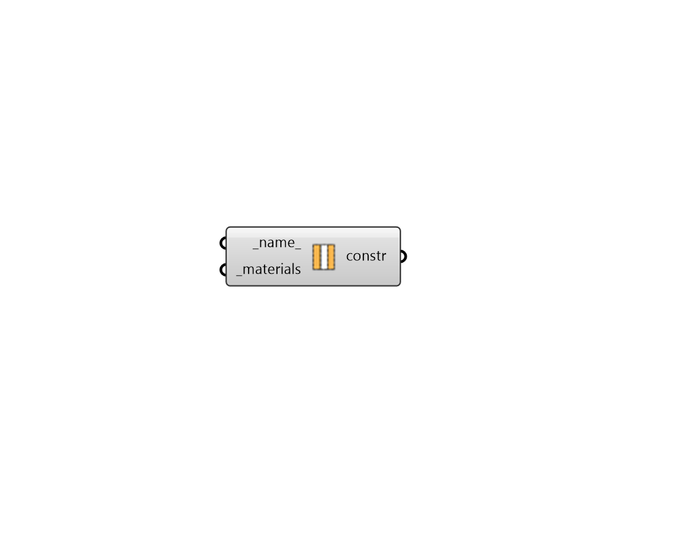

## Opaque Construction

 - [[source code]](https://github.com/ladybug-tools/honeybee-grasshopper-energy/blob/master/honeybee_grasshopper_energy/src//HB%20Opaque%20Construction.py)

Create an EnergyPlus opaque construction. Material inputs can be either the identifiers of materials within the library or a custom material made with any of the EnergyPlus Material components. 

Note that the _materials should be ordered from outermost (exterior) layer to the innermost (interior) layer. 

#### Inputs
* ##### name 
Text to set the name for the Construction and to be incorporated into a unique Construction identifier. 
* ##### materials [Required]
List of materials in the construction (from exterior to interior). These materials can be either fully-detailed material objects built with the material components or text for a material identifier to be looked up in the opaque material library.  Note that a native Grasshopper "Merge" component can be used to help order the materials correctly for the input here. 

#### Outputs
* ##### constr
An opaque construction that can be assigned to Honeybee Faces or ConstructionSets. 