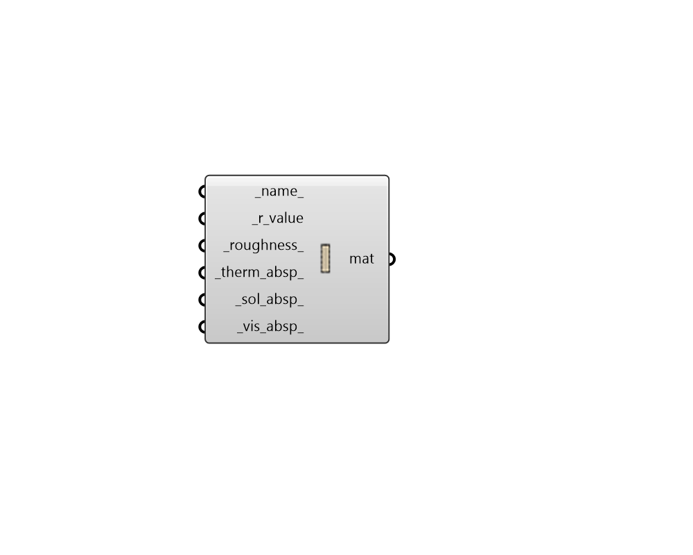

## Opaque Material No Mass

 - [[source code]](https://github.com/ladybug-tools/honeybee-grasshopper-energy/blob/master/honeybee_grasshopper_energy/src//HB%20Opaque%20Material%20No%20Mass.py)

Create an opaque material that has no mass, which can be plugged into the "HB Opaque Construction" component. 

#### Inputs
* ##### name 
Text to set the name for the material and to be incorporated into a unique material identifier. 
* ##### r_value [Required]
Number for the R-value of the material [m2-K/W]. 
* ##### roughness 
Text describing the relative roughness of a particular material. Must be one of the following: 'VeryRough', 'Rough', 'MediumRough', 'MediumSmooth', 'Smooth', 'VerySmooth'. (Default: 'MediumRough'). 
* ##### therm_absp 
A number between 0 and 1 for the fraction of incident long wavelength radiation that is absorbed by the material. (Default: 0.9). 
* ##### sol_absp 
A number between 0 and 1 for the fraction of incident solar radiation absorbed by the material. (Default: 0.7). 
* ##### vis_absp 
A number between 0 and 1 for the fraction of incident visible wavelength radiation absorbed by the material. Default value is the same as the _sol_absp_. 

#### Outputs
* ##### mat
A no-mass opaque material that can be assigned to a Honeybee Opaque construction. 