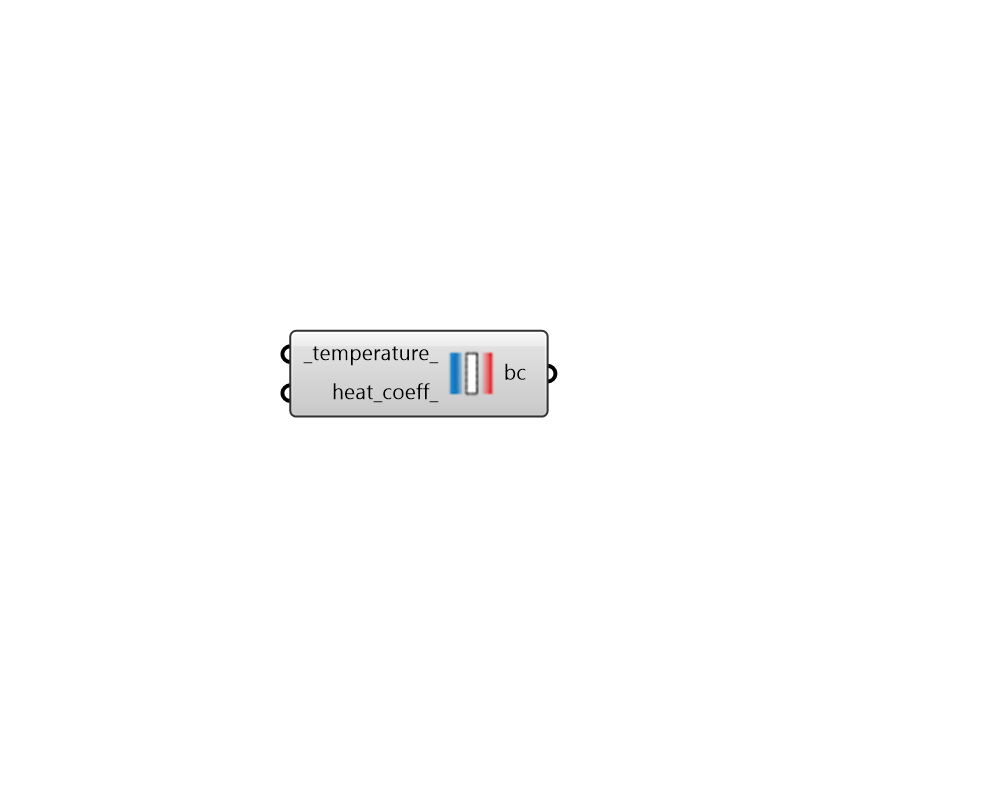

## Other Side Temperature

 - [[source code]](https://github.com/ladybug-tools/honeybee-grasshopper-energy/blob/master/honeybee_grasshopper_energy/src//HB%20Other%20Side%20Temperature.py)

Create a boundary condition representing a custom temperature and/or heat transfer coefficient on the other side of a face. 

#### Inputs
* ##### temperature 
A temperature value in Celsius to note the temperature on the other side of the object. If unspecified, the outdoor air temperature will be used. 
* ##### heat_coeff 
A value in W/m2-K to indicate the combined convective/radiative film coefficient. If equal to 0, then the specified temperature above is equal to the exterior surface temperature. Otherwise, the temperature above is considered the outside air temperature and this coefficient is used to determine the difference between this outside air temperature and the exterior surface temperature. (Default: 0). 

#### Outputs
* ##### bc
A BoundaryCondition object that can be assigned to any honeybee Face object (using the "HB Face" component or the "HB Properties by Guide Surface"). 