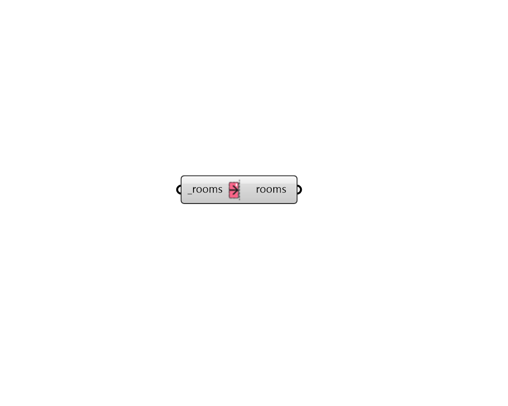

## Patch Missing Adjacency

 - [[source code]](https://github.com/ladybug-tools/honeybee-grasshopper-energy/blob/master/honeybee_grasshopper_energy/src//HB%20Patch%20Missing%20Adjacency.py)

Set any Faces of Rooms with missing adjacencies to Adiabatic. 

This is useful when simulating a subset of Rooms from a larger Model. 

If any of the Faces with missing adjacencies have sub-faces, these will be removed in order to accommodate the adiabatic condition. Similarly, if the Face is an AirBoundary, the type will be set to a Wall. 

#### Inputs
* ##### rooms [Required]
A list of Honeybee Rooms which will have its adjacencies patched with Adiabatic boundary conditions. This can also be an entire honyebee Model. Any adjacnecy not found across all of the rooms will be replaced with an Adiabatic boundary. 

#### Outputs
* ##### rooms
Rooms that have had their missing adjacencies patched. 