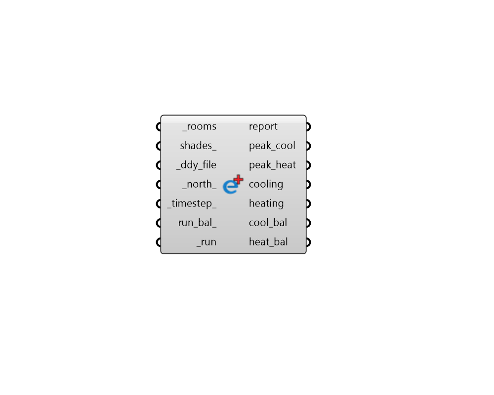

## Peak Loads

 - [[source code]](https://github.com/ladybug-tools/honeybee-grasshopper-energy/blob/master/honeybee_grasshopper_energy/src//HB%20Peak%20Loads.py)

Run Honeybee Rooms through a quick energy simulation to obtain an estimate of room-level peak cooling and heating on summer and winter design days. 

#### Inputs
* ##### rooms [Required]
A list of Honeybee Rooms for which peak loads will be computed. 
* ##### shades 
An optional list of Honeybee Shades that can block the sun to the input _rooms. 
* ##### ddy_file [Required]
Path to a .ddy file on your system as a text string, which contains design day conditions for the peak load analysis. This can also be the path to an .epw file, in which case design days will be determined by statitically analysing the annual data to approximate 0.4% and 99.6% design conditions. 
Note that custom .ddy files can be crafted from EPW or STAT data using the "LB EPW to DDY" component. They can also also be created from raw sets of outdoor conditions using the "DF Construct Design Day" and "DF Write DDY" components. 
When constructing custom DDY files, it is recommended that the .ddy file contain only one summer and one winter design day. Alternatively, if you wish to specify multiple cooling design day conditions for each month of the year (to evaluate solar load in each month), each of these cooling design days should contain "0.4%" in the design day name along with " DB=>MWB". This convention will automatically be followed when using the "monthly_cool_" option on the "LB EPW to DDY" component. 
In this situation of multiple monthly cooling design days, this component will report peak_cool zone sizes that correspond to the highest month for each zone and the output cooling data collection will be for the month with the highest coincident peak cooling. 
* ##### north 
A number between -360 and 360 for the counterclockwise difference between the North and the positive Y-axis in degrees. 90 is West and 270 is East. (Default: 0). 
* ##### timestep 
An integer for the number of timesteps per hour at which the energy simulation will be run and results reported. It is recommended that this be at least 6 but it can be increased to better capture the minute in which peak cooling occurs. (Default: 6). The following values are acceptable: (1, 2, 3, 4, 5, 6, 10, 12, 15, 20, 30, 60) 
* ##### run_bal 
Set to True to have the load balance computed after the simulation is run. This ensures that data collections for various terms of the load balance are output from the "balance". This can help explain why the loads are what they are but can also increase the component run time. (Default: False). 
* ##### run [Required]
Set to "True" to run the simulation to obtain annual loads. This can also be the integer 2 to run the simulation while being able to see the simulation process (with a batch window). 

#### Outputs
* ##### report
A report of the energy simulation run. 
* ##### peak_cool
A list of numbers that align with the input _rooms and correspond to the peak cooling of each room on the summer design day in Watts. Note that, for multi-room simulations, the individual room peaks may not be coincident, meaning that summing these values together won't give a correct sense of the size of cetral cooling equipment serving multiple rooms. For such equipment, the max of the cooling data collection should be used. 
* ##### peak_heat
A list of numbers that align with the input _rooms and correspond to the peak heating of each room on the winter design day in Watts. Note that, for multi-room simulations, the individual room peaks may not be coincident, meaning that summing these values together won't give a correct sense of the size of cetral heating equipment serving multiple rooms. For such equipment, the max of the heating data collection should be used. 
* ##### cooling
A Data Collection indicating the combined cooling demand of the rooms at each simulation timestep of the summer design day. This can be plugged into the "LB Monthly Chart" component to visualize the demand or it can be deconstructed with the "LB Deconstruct Data" component for analysis. 
* ##### heating
A Data Collection indicating the combined heating demand of the rooms at each simulation timestepof the winter design day. This can be plugged into the "LB Monthly Chart" component to visualize the demand or it can be deconstructed with the "LB Deconstruct Data" component for analysis. 
* ##### cool_bal
A list of data collections for the various terms of the sensible load balance that contribute to peak cooling on the summer design day. These can be plugged into the "LB Monthly Chart" component (with stack_ set to True) to visualize the terms contributing to the peak. Will be None unless run_bal_ is set to True. 
* ##### heat_bal
A list of data collections for the various terms of the sensible load balance that contribute to peak heating on the summer design day. These can be plugged into the "LB Monthly Chart" component (with stack_ set to True) to visualize the terms contributing to the peak. Will be None unless run_bal_ is set to True. 