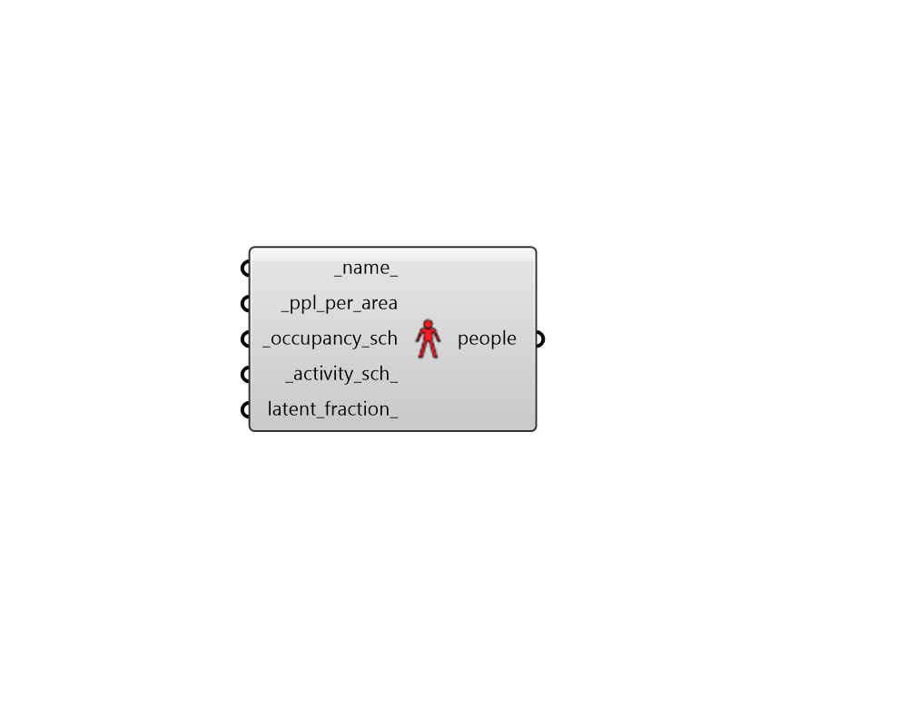

## People

 - [[source code]](https://github.com/ladybug-tools/honeybee-grasshopper-energy/blob/master/honeybee_grasshopper_energy/src//HB%20People.py)

Create a People object that can be used to create a ProgramType or be assigned directly to a Room. 

#### Inputs
* ##### name 
Text to set the name for the People and to be incorporated into a unique People identifier. If None, a unique name will be generated. 
* ##### ppl_per_area [Required]
A numerical value for the number of people per square meter of floor area. 
* ##### occupancy_sch [Required]
A fractional schedule for the occupancy over the course of the year. The fractional values in this schedule will get multiplied by the _people_per_area to yield a complete occupancy profile. 
* ##### activity_sch 
A schedule for the activity of the occupants over the course of the year. The type limt of this schedule should be "Activity Level" and the values of the schedule equal to the number of Watts given off by an individual person in the room. If None, it will a default constant schedule with 120 Watts per person will be used, which is typical of awake, adult humans who are seated. 
* ##### latent_fraction 
An optional number between 0 and 1 for the fraction of the heat given off by people that is latent (as opposed to sensible). when unspecified, this will be autocalculated based on the activity level and the conditions in the room at each timestep of the simulation. The autocalculation therefore accounts for the change in heat loss through respiration and sweating that occurs at warmer temperatures and higher activity levels, which is generally truer to physics compared to a fixed number. 

#### Outputs
* ##### people
A People object that can be used to create a ProgramType or be assigned directly to a Room. 