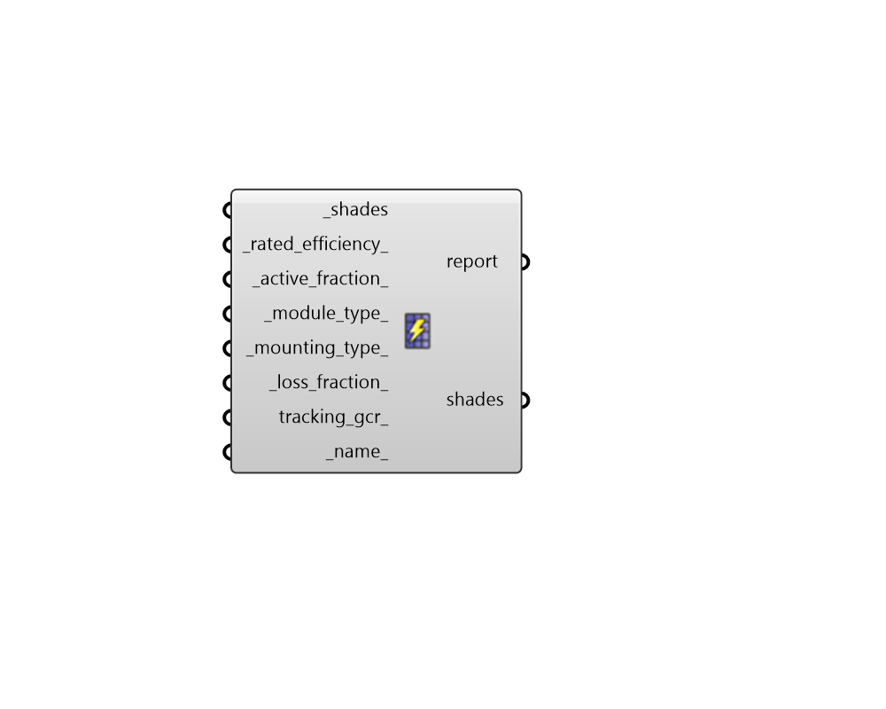

## Photovoltaic Properties

 - [[source code]](https://github.com/ladybug-tools/honeybee-grasshopper-energy/blob/master/honeybee_grasshopper_energy/src//HB%20Photovoltaic%20Properties.py)

Assign photovoltaic properties to a honeybee Shade such that it will generate electricity in energy simulations. 

#### Inputs
* ##### shades [Required]
Honeybee Shades to which photovoltaic properties will be assigned. 
* ##### rated_efficiency 
A number between 0 and 1 for the rated nameplate efficiency of the photovoltaic solar cells under standard test conditions (STC). 
Standard test conditions are 1,000 Watts per square meter solar irradiance, 25 degrees C cell temperature, and ASTM G173-03 standard spectrum. Nameplate efficiencies reported by manufacturers are typically under STC. 
Standard poly- or mono-crystalline silicon modules tend to have rated efficiencies in the range of 14-17%. Premium high efficiency mono-crystalline silicon modules with anti-reflective coatings can have efficiencies in the range of 18-20%. Thin film photovoltaic modules typically have efficiencies of 11% or less. (Default: 0.15 for standard silicon solar cells). 
* ##### active_fraction 
The fraction of the parent Shade geometry that is covered in active solar cells. This fraction includes the difference between the PV panel (aka. PV module) area and the active cells within the panel as well as any losses for how the (typically rectangular) panels can be arranged on the Shade geometry. When the parent Shade geometry represents just the solar panels, this fraction is typically around 0.9 given that the framing elements of the panel reduce the overall active area. (Default: 0.9). 
* ##### module_type 
Text or an integer to indicate the type of solar module. This is used to determine the temperature coefficients used in the simulation of the photovoltaic modules. Choose from the three options below. If unspecified, the module_type will be inferred from the rated_efficiency of these PVProperties using the rated efficiencies listed below. 

    * 0 - Standard - 12% <= rated_efficiency < 18%

    * 1 - Premium - rated_efficiency >= 18%

    * 2 - ThinFilm - rated_efficiency < 12%
* ##### mounting_type 
Text or an integer to indicate the type of mounting and/or tracking used for the photovoltaic array. Note that the OneAxis options have an axis of rotation that is determined by the azimuth of the parent Shade geometry. Also note that, in the case of one or two axis tracking, shadows on the (static) parent Shade geometry still reduce the electrical output, enabling the simulation to account for large context geometry casting shadows on the array. However, the effects of smaller detailed shading may be improperly accounted for and self shading of the dynamic panel geometry is only accounted for via the tracking_gcr property. Choose from the following. (Default: FixedOpenRack). 

    * 0 - FixedOpenRack - ground or roof mounting where the air flows freely

    * 1 - FixedRoofMounted - mounting flush with the roof with limited air flow

    * 2 - OneAxis - a fixed tilt and azimuth, which define an axis of rotation

    * 3 - OneAxisBacktracking - same as OneAxis but with controls to reduce self-shade

    * 4 - TwoAxis - a dynamic tilt and azimuth that track the sun
* ##### loss_fraction 
A number between 0 and 1 for the fraction of the electricity output lost due to factors other than EPW climate conditions, panel efficiency/type, active area, mounting, and inverter conversion from DC to AC. 
Factors that should be accounted for in this input include soiling, snow, wiring losses, electrical connection losses, manufacturer defects/tolerances/mismatch in cell characteristics, losses from power grid availability, and losses due to age or light-induced degradation. 
Losses from these factors tend to be between 10-20% but can vary widely depending on the installation, maintenance and the grid to which the panels are connected. The loss_fraction_from_components staticmethod on this class can be used to estimate this value from the various factors that it is intended to account for. (Default: 0.14). 
* ##### tracking_gcr 
A number between 0 and 1 that ONLY APPLIES TO ARRAYS WITH ONE AXIS mounting_type. 
The ground coverage ratio (GCR) is the ratio of module surface area to the area of the ground beneath the array, which is used to account for self shading of single-axis panels as they move to track the sun. A GCR of 0.5 means that, when the modules are horizontal, half of the surface below the array is occupied by the array. An array with wider spacing between rows of modules has a lower GCR than one with narrower spacing. A GCR of 1 would be for an array with no space between modules, and a GCR of 0 for infinite spacing between rows. Typical values range from 0.3 to 0.6. (Default: 0.4). 
* ##### name 
An optional text name for the photovoltaic properties. This can be useful for keeping track of different photovoltaics when using several of these components. If unspecified, a unique one will be generated. 

#### Outputs
* ##### report
Reports, errors, warnings, etc. 
* ##### shades
The input Shades with photovoltaic properties assigned. 