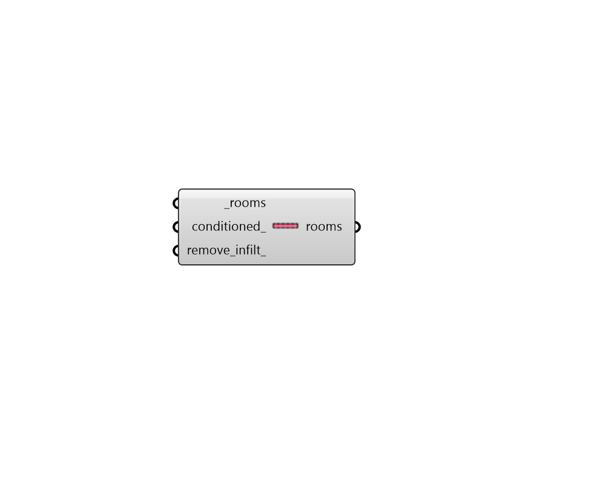

## Plenum

 - [[source code]](https://github.com/ladybug-tools/honeybee-grasshopper-energy/blob/master/honeybee_grasshopper_energy/src//HB%20Plenum.py)

Turn Honeybee Rooms into Plenums with no internal loads. 

This includes removing all people, lighting, equipment, hot water, and mechanical ventilation. By default, the heating/cooling system and setpoints will also be removed but they can optionally be kept. Infiltration is kept by default but can optionally be removed as well. 

This is useful to appropriately assign properties for closets, underfloor spaces, and drop ceilings. 

#### Inputs
* ##### rooms [Required]
Honeybee Rooms to be converted into plenums. 
* ##### conditioned 
Boolean to indicate whether the plenum is conditioned with a heating/cooling system. If True, the setpoints of the Room will also be kept in addition to the heating/cooling system (Default: False). 
* ##### remove_infilt 
Boolean to indicate whether infiltration should be removed from the Rooms. (Default: False). 

#### Outputs
* ##### rooms
Rooms that have had their interinal loads removed to reflect a plenum space. 