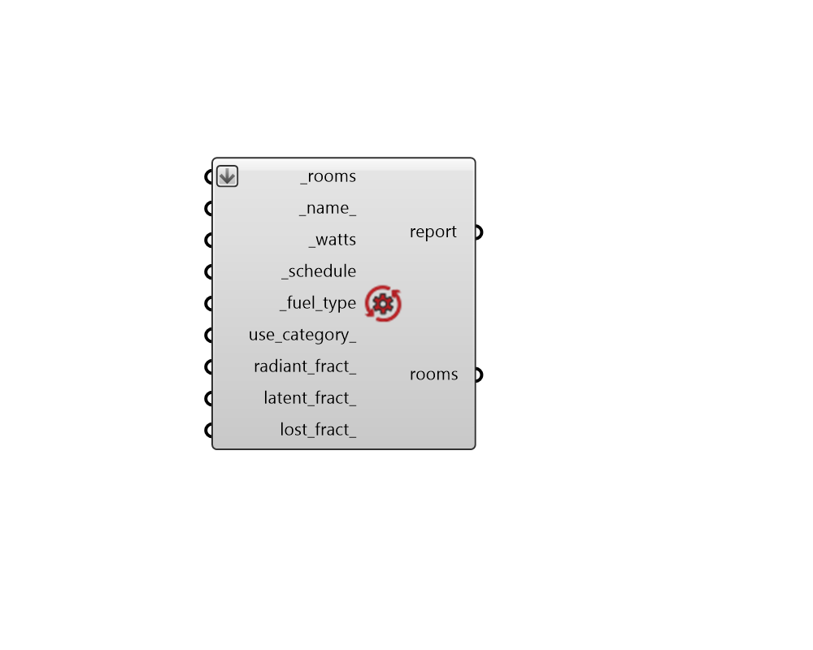

## Process Load

 - [[source code]](https://github.com/ladybug-tools/honeybee-grasshopper-energy/blob/master/honeybee_grasshopper_energy/src//HB%20Process%20Load.py)

Apply process loads to Rooms. 

Examples of process loads include wood burning fireplaces, kilns, manufacturing equipment, and various industrial processes. They can also be used to represent  certain specialized pieces of equipment to be separated from the other end uses, such as MRI machines, theatrical lighting, elevators, etc. 

#### Inputs
* ##### rooms [Required]
Honeybee Rooms to which process loads should be assigned. 
* ##### name 
Text to set the name for the Process load and to be incorporated into a unique Process load identifier. If None, a unique name will be generated. 
* ##### watts [Required]
A number for the process load power in Watts. 
* ##### schedule [Required]
A fractional schedule for the use of the process over the course of the year. The fractional values will get multiplied by the _watts to yield a complete process load profile. 
* ##### fuel_type [Required]
Text to denote the type of fuel consumed by the process. Using the "None" type indicates that no end uses will be associated with the process, only the zone gains. Choose from the following. 

    * Electricity

    * NaturalGas

    * Propane

    * FuelOilNo1

    * FuelOilNo2

    * Diesel

    * Gasoline

    * Coal

    * Steam

    * DistrictHeating

    * DistrictCooling

    * OtherFuel1

    * OtherFuel2

    * None
* ##### use_category 
Text to indicate the end-use subcategory, which will identify the process load in the EUI output. For example, “Cooking”, “Clothes Drying”, etc. (Default: General). 
* ##### radiant_fract 
A number between 0 and 1 for the fraction of the total process load given off as long wave radiant heat. (Default: 0). 
* ##### latent_fract 
A number between 0 and 1 for the fraction of the total process load that is latent (as opposed to sensible). (Default: 0). 
* ##### lost_fract 
A number between 0 and 1 for the fraction of the total process load that is lost outside of the zone and the HVAC system. Typically, this is used to represent heat that is exhausted directly out of a zone (as you would for a stove). (Default: 0). 

#### Outputs
* ##### report
Reports, errors, warnings, etc. 
* ##### rooms
The input Rooms with process loads assigned to them. 