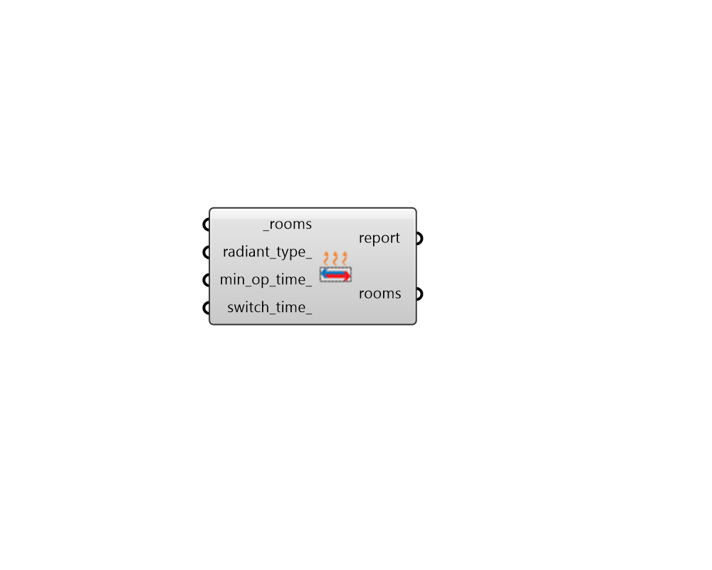

## Radiant HVAC Properties

 - [[source code]](https://github.com/ladybug-tools/honeybee-grasshopper-energy/blob/master/honeybee_grasshopper_energy/src//HB%20Radiant%20HVAC%20Properties.py)

Adjust the properties of a Radiant HVAC that has been assigned to Honeybee Rooms. 

Because Radiant HVAC systems interact with the conditioned rooms through the thermal mass of the constructions in which they are embedded, their design often requires 

#### Inputs
* ##### rooms [Required]
Honeybee Rooms that have a Radiant HVAC assigned to them, which are to have their radiant properties adjusted. This can also be a Honeybee Model for which all Rooms with a Radiant HVAC sill be adjusted. 
* ##### radiant_type 
Text to indicate which faces are thermally active by default. Note that systems are assumed to be embedded in concrete slabs with no insulation within the slab unless otherwise specified. Choose from the following. (Default: Floor). 

    * Floor

    * Ceiling

    * FloorWithCarpet

    * CeilingMetalPanel

    * FloorWithHardwood
* ##### min_op_time 
A number for the minimum number of hours of operation for the radiant system before it shuts off. (Default: 1). 
* ##### switch_time 
A number for the minimum number of hours for when the system can switch between heating and cooling. (Default: 24). 

#### Outputs
* ##### report
The execution information, as output and error streams 
* ##### rooms
The input Rooms with the radiant HVAC properties edited. 