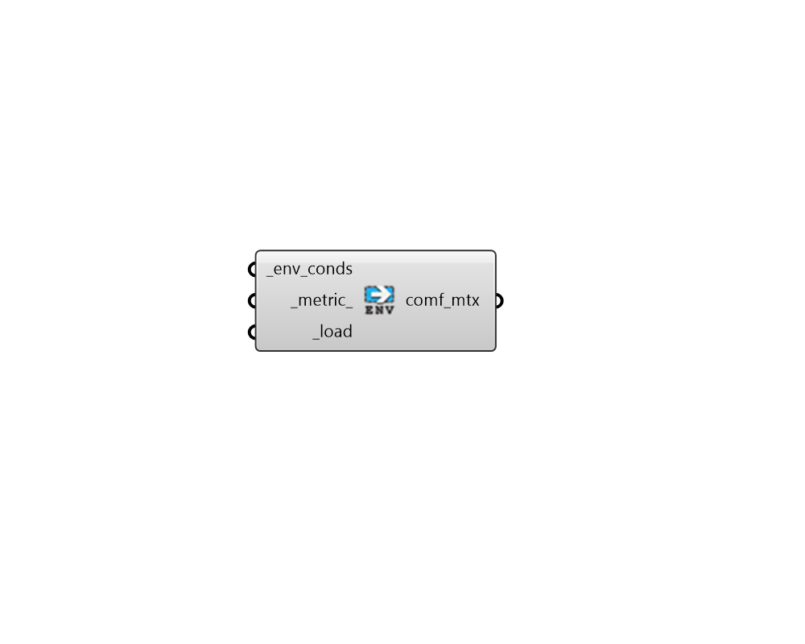

## Read Environment Matrix

 - [[source code]](https://github.com/ladybug-tools/honeybee-grasshopper-energy/blob/master/honeybee_grasshopper_energy/src//HB%20Read%20Environment%20Matrix.py)

Read the detailed environmental conditions of a thermal mapping analysis from the env_conds output by a thermal mapping component. 

Environemntal conditions include raw inputs to the thermal comfort model, such as air temperature, MRT, longwave MRT, and shortwave MRT delta. 

#### Inputs
* ##### env_conds [Required]
Path to a folder containing the detailed environmental conditions output by a thermal mapping component. 
* ##### metric 
Text or an integer for the specific metric to be loaded from the environmental conditions. (Default: MRT). Choose from the following. 

    * 0 - MRT

    * 1 - Air Temperature

    * 2 - Longwave MRT

    * 3 - Shortwave MRT Delta

    * 4 - Relative Humidity
* ##### load [Required]
Set to True to load the data into Grasshopper. 

#### Outputs
* ##### comf_mtx
A Matrix object that can be connected to the "HB Visualize Thermal Map" component in order to spatially visualize results. This Matrix object can also be connected to the "LB Deconstruct Matrix" component to obtain detailed point-by-point and hour-by-hour values. 
When deconstructed, each sub-list of the matrix (aka. branch of the Data Tree) represents one of the sensor grids used for analysis. The length of each sub-list matches the number of points in the grid. Each value in the sub-list is an hourly data collection containing hour-by-hour results for each point. 