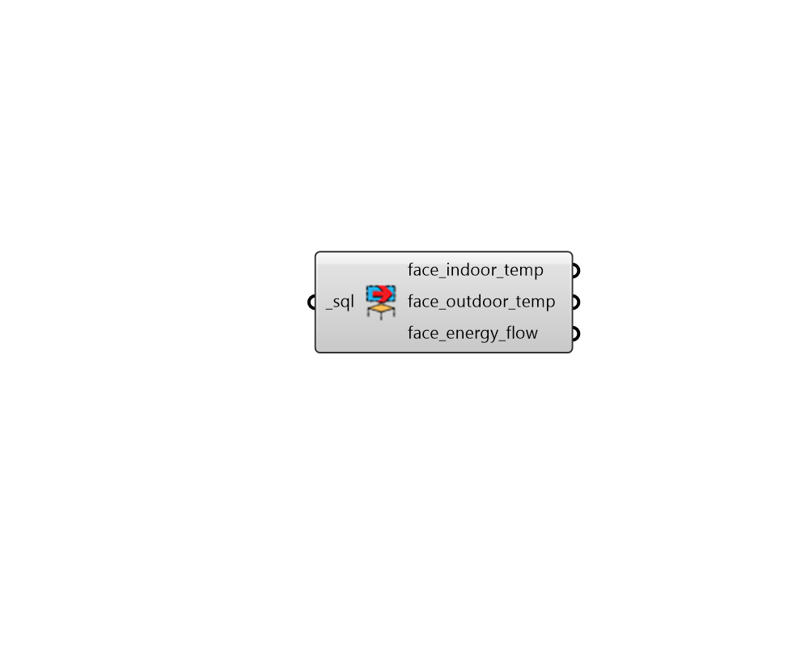

## Read Face Result

 - [[source code]](https://github.com/ladybug-tools/honeybee-grasshopper-energy/blob/master/honeybee_grasshopper_energy/src//HB%20Read%20Face%20Result.py)

Parse all of the common Room-level comfort-related results from an SQL result file that has been generated from an energy simulation. 

#### Inputs
* ##### sql [Required]
The file path of the SQL result file that has been generated from an energy simulation. 

#### Outputs
* ##### face_indoor_temp
DataCollections for the indoor surface temperature of each surface (C). 
* ##### face_outdoor_temp
DataCollections for the outdoor surface temperature of each surface (C). 
* ##### face_energy_flow
DataCollections for the heat loss (negative) or heat gain (positive) through each building surfaces (kWh). 