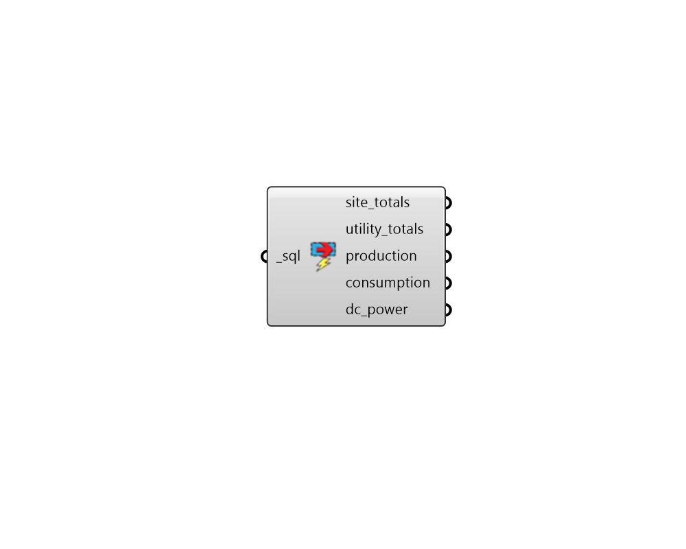

## Read Generation Result

 - [[source code]](https://github.com/ladybug-tools/honeybee-grasshopper-energy/blob/master/honeybee_grasshopper_energy/src//HB%20Read%20Generation%20Result.py)

Parse electricity generation results from an energy simulation SQL result file. 

#### Inputs
* ##### sql [Required]
The file path of the SQL result file that has been generated from an energy simulation. 

#### Outputs
* ##### site_totals
Two numbers indicating the following energy values in kWh. 

    * Total on-site produced electricity (postive number)

    * Total on-site electricity consumption (negative number)
* ##### utility_totals
Three numbers indicating the following energy values in kWh. 

    * Total on-site produced electricity consumed on-site (positive number)

    * Total on-site produced surplus electricity sold to the utility (positive number)

    * Total electricity purchased from the utility (negative number)
* ##### production
A data collection of all on-site produced electricity (kWh). This represents the alternating current (AC) electricity coming out of the inverter that processes all on-site power production. 
* ##### consumption
A data collection of all on-site consumed electricity (kWh). This represents the electrcicity consumed by all heating, cooling, lighting equipment, fans, pumps, process loads, and water heaters. All of this consumed electricity is assumed to be alternating current (AC). 
* ##### dc_power
A list of data collections for the direct current (DC) electricity produced by each on-site electricity generator (kWh). Each photovoltaic object will have a separate data collection. 