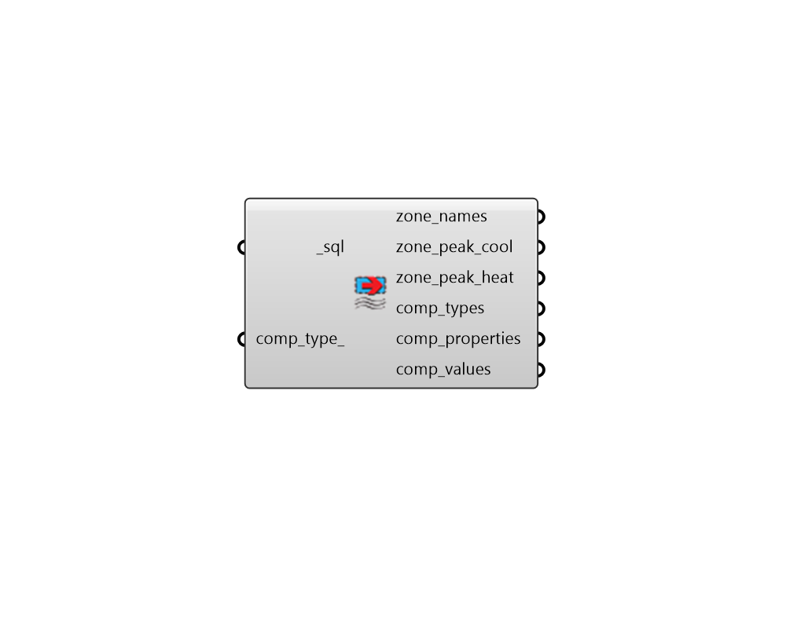

## Read HVAC Sizing

 - [[source code]](https://github.com/ladybug-tools/honeybee-grasshopper-energy/blob/master/honeybee_grasshopper_energy/src//HB%20Read%20HVAC%20Sizing.py)

Parse the peak load and HVAC component sizes from an SQL result file that has been generated from an energy simulation. 

#### Inputs
* ##### sql [Required]
The file path of the SQL result file that has been generated from an energy simulation. 
* ##### comp_type 
An optional name of a HVAC component type, which will filter the HVAC components that appear in the output comp_props and comp_values. Connecting nothing here will mean that all HVAC component sizes are imported and a full list of possible components will appear in the comp_types output. 

#### Outputs
* ##### zone_names
A list of zone names (honeybee Room identifiers) that correspond to the zone_peak_load and zone_peak_heat below. 
* ##### zone_peak_cool
A list of numbers for the peak cooling load of each zone on the summer design day. These correspond to the zone_names above. All values are in Watts. 
* ##### zone_peak_heat
A list of numbers for the peak heating load of each zone on the winter design day. These correspond to the zone_names above. All values are in Watts. 
* ##### comp_types
A list of HVAC component types that are available in the results. This will be equal to the input comp_type_ if a value is connected. 
* ##### comp_properties
A list of text descriptions for HVAC component properties. These correspond to the comp_values below. 
* ##### comp_values
Values denoting the size of various zone HVAC components  (eg. zone terminal sizes, boiler/chiller sizes, lengths of chilled beams, etc.). These correspond to the comp_properties above. Values may be in different units (eg. W, m/s, etc.) depending on the property of the component being observed. 