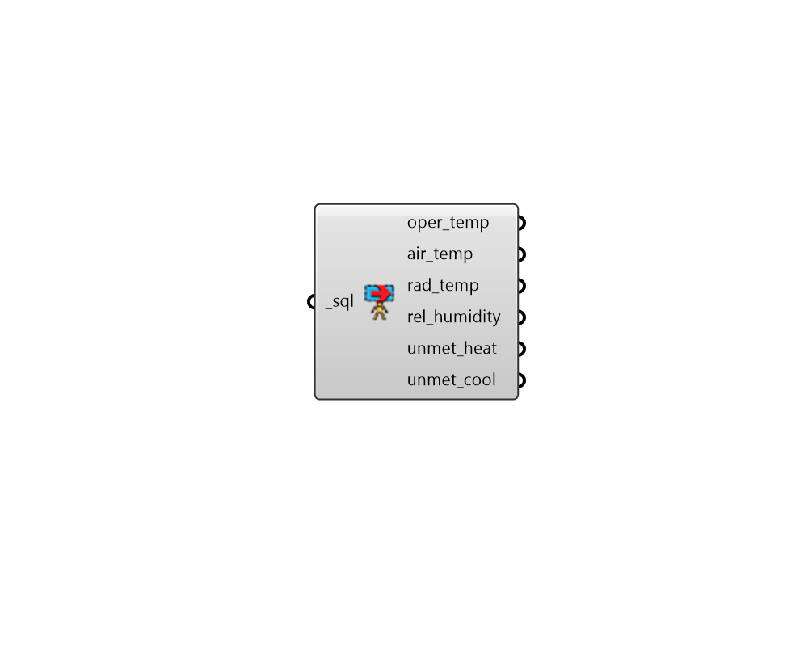

## Read Room Comfort Result

 - [[source code]](https://github.com/ladybug-tools/honeybee-grasshopper-energy/blob/master/honeybee_grasshopper_energy/src//HB%20Read%20Room%20Comfort%20Result.py)

Parse all of the common Room-level comfort-related results from an SQL result file that has been generated from an energy simulation. 

#### Inputs
* ##### sql [Required]
The file path of the SQL result file that has been generated from an energy simulation. 

#### Outputs
* ##### oper_temp
DataCollections for the mean operative temperature of each room (C). 
* ##### air_temp
DataCollections for the mean air temperature of each room (C). 
* ##### rad_temp
DataCollections for the mean radiant temperature of each room (C). 
* ##### rel_humidity
DataCollections for the relative humidity of each room (%). 
* ##### unmet_heat
DataCollections for time that the heating setpoint is not met in each room (hours). 
* ##### unmet_cool
DataCollections for time that the cooling setpoint is not met in each room (hours). 