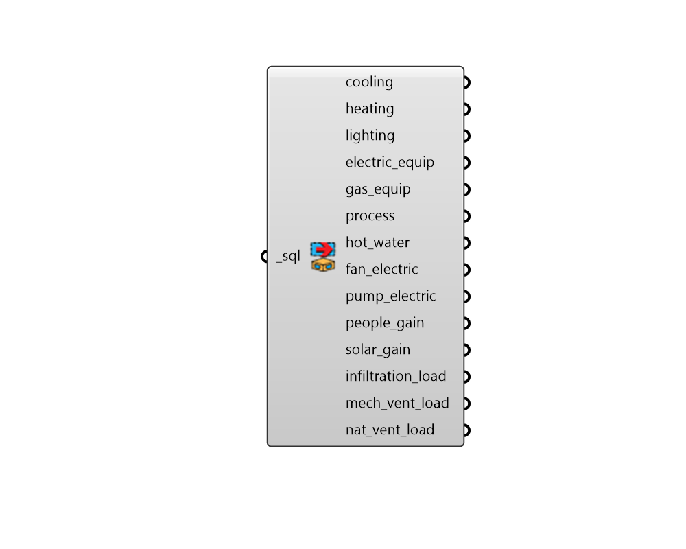

## Read Room Energy Result

 - [[source code]](https://github.com/ladybug-tools/honeybee-grasshopper-energy/blob/master/honeybee_grasshopper_energy/src//HB%20Read%20Room%20Energy%20Result.py)

Parse all of the common Room-level energy-related results from an SQL result file that has been generated from an energy simulation. 

#### Inputs
* ##### sql [Required]
The file path of the SQL result file that has been generated from an energy simulation. 

#### Outputs
* ##### cooling
DataCollections for the cooling energy in kWh. For Ideal Air loads, this output is the sum of sensible and latent heat that must be removed from each room.  For detailed HVAC systems, this output will be electric energy needed to power each chiller/cooling coil. 
* ##### heating
DataCollections for the heating energy needed in kWh. For Ideal Air loads, this is the heat that must be added to each room.  For detailed HVAC systems, this will be fuel energy or electric energy needed for each boiler/heating element. 
* ##### lighting
DataCollections for the electric lighting energy used for each room in kWh. 
* ##### electric_equip
DataCollections for the electric equipment energy used for each room in kWh. 
* ##### gas_equip
DataCollections for the gas equipment energy used for each room in kWh. 
* ##### hot_water
DataCollections for the service hote water energy used for each room in kWh. 
* ##### fan_electric
DataCollections for the fan electric energy in kWh for either a ventilation fan or a HVAC system fan. 
* ##### pump_electric
DataCollections for the water pump electric energy in kWh for a heating/cooling system. 
* ##### people_gain
DataCollections for the internal heat gains in each room resulting from people (kWh). 
* ##### solar_gain
DataCollections for the total solar gain in each room (kWh). 
* ##### infiltration_load
DataCollections for the heat loss (negative) or heat gain (positive) in each room resulting from infiltration (kWh). 
* ##### mech_vent_load
DataCollections for the heat loss (negative) or heat gain (positive) in each room resulting from the outdoor air coming through the HVAC System (kWh). 
* ##### nat_vent_load
DataCollections for the heat loss (negative) or heat gain (positive) in each room resulting from natural ventilation (kWh). 