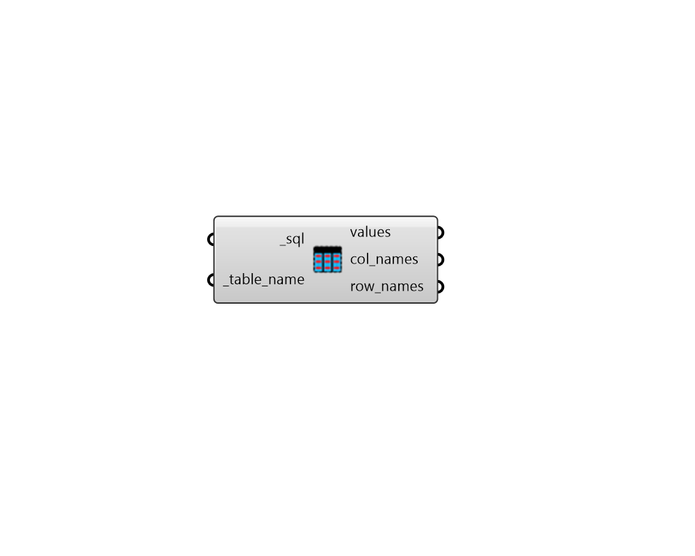

## Read Tabular Data

 - [[source code]](https://github.com/ladybug-tools/honeybee-grasshopper-energy/blob/master/honeybee_grasshopper_energy/src//HB%20Read%20Tabular%20Data.py)

Get all the data within a table of a Summary Report using the table name. 

All of the avaialable tables can be browsed by opening the .html output from the simulation in a web browser. 

#### Inputs
* ##### sql [Required]
The file path of the SQL result file that has been generated from an energy simulation. 
* ##### table_name [Required]
Text string for the name of a table of a Summary Report. Examples include: General, Utility Use Per Conditioned Floor Area, and many more options that can be browsed in the .html file. 

#### Outputs
* ##### values
A data tree represening the table matrix, with each branch (sub-list) of the tree representing a row of the table and each index of each branch corresponding to a value in a column. The order of outputs should reflect how the table appears in the HTML output. Note that any energy values in MJ or GJ in the .html output will automatically be converted to kWh on import. 
* ##### col_names
A list of text for the names of each of the columns in the table. These order of this list corresponds directly to the order of items each of the values sub-list 
* ##### row_names
A list of text for the names of each of the rows of the table. Each name in this list corresponds to a branch in the output values data tree. 