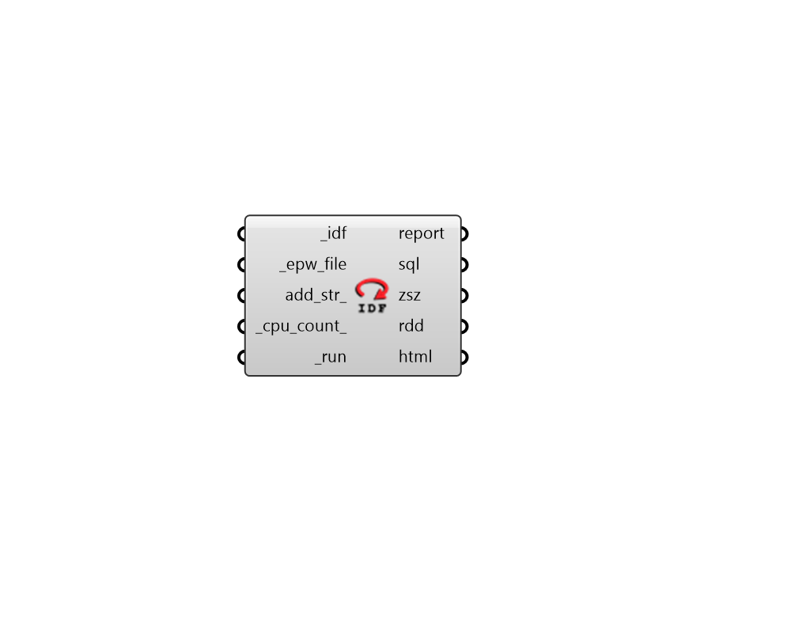

## Run IDF

 - [[source code]](https://github.com/ladybug-tools/honeybee-grasshopper-energy/blob/master/honeybee_grasshopper_energy/src//HB%20Run%20IDF.py)

Run an IDF file through EnergyPlus. 

#### Inputs
* ##### idf [Required]
Path to an IDF file as a text string. This can also be a list of IDF files. 
* ##### epw_file [Required]
The full file path to epw weather file that you would like the simulation to run with. 
* ##### cpu_count 
An integer to set the number of CPUs used in the execution of each connected IDF file. If unspecified, it will automatically default to one less than the number of CPUs currently available on the machine (or 1 if only one processor is available). 
* ##### run [Required]
Set to "True" to run the IDF through EnergyPlus. 
This input can also be the integer "2", which will run the whole simulation silently (without any batch windows). 

#### Outputs
* ##### report
Check here to see a report of the EnergyPlus run. 
* ##### sql
The file path of the SQL result file that has been generated on your machine. 
* ##### zsz
Path to a .csv file containing detailed zone load information recorded over the course of the design days. 
* ##### rdd
The file path of the Result Data Dictionary (.rdd) file that is generated after running the file through EnergyPlus.  This file contains all possible outputs that can be requested from the EnergyPlus model.  Use the Read Result Dictionary component to see what outputs can be requested. 
* ##### html
The HTML file path of the Summary Reports. Note that this will be None unless the input _sim_par_ denotes that an HTML report is requested and _run is set to True. 