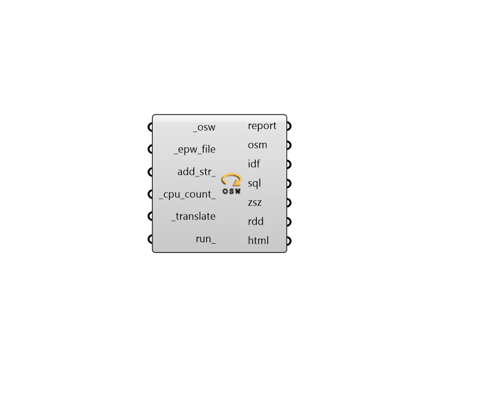

## Run OSW

 - [[source code]](https://github.com/ladybug-tools/honeybee-grasshopper-energy/blob/master/honeybee_grasshopper_energy/src//HB%20Run%20OSW.py)

Execute an OpenStudio workflow (.osw) and run the resulting IDF file through EnergyPlus. 

#### Inputs
* ##### osw [Required]
Path to an OSW file as a text string. This can also be a list of OSW files. 
* ##### epw_file [Required]
Path to an .epw file as a text string. 
* ##### add_str 
THIS OPTION IS JUST FOR ADVANCED USERS OF ENERGYPLUS. You can input additional text strings here that you would like written into the IDF.  The strings input here should be complete EnergyPlus objects that are correctly formatted. This input can be used to write objects into the IDF that are not currently supported by Honeybee. 
* ##### cpu_count 
An integer to set the number of CPUs used in the execution of each connected OSW file. If unspecified, it will automatically default to one less than the number of CPUs currently available on the machine (or 1 if only one processor is available). 
* ##### translate [Required]
Set to "True" to execute the input OSWs using the OpenStudio command line interface (CLI). This will translate any honeybee jsons referenced in the osw to an osm and idf file. 
* ##### run 
Set to "True" to run the resulting IDF through EnergyPlus. 
This input can also be the integer "2", which will run the whole translation and simulation silently (without any batch windows). 

#### Outputs
* ##### report
Check here to see a report of the EnergyPlus run. 
* ##### osm
The file path to the OpenStudio Model (OSM) that has been generated on this computer. 
* ##### idf
The file path of the IDF file that has been generated on this computer. 
* ##### sql
The file path of the SQL result file that has been generated on your machine. This will be None unless run_ is set to True. 
* ##### zsz
Path to a .csv file containing detailed zone load information recorded over the course of the design days. This will be None unless run_ is set to True. 
* ##### rdd
The file path of the Result Data Dictionary (.rdd) file that is generated after running the file through EnergyPlus.  This file contains all possible outputs that can be requested from the EnergyPlus model.  Use the Read Result Dictionary component to see what outputs can be requested. 
* ##### html
The HTML file path of the Summary Reports. Note that this will be None unless the input _sim_par_ denotes that an HTML report is requested and run_ is set to True. 