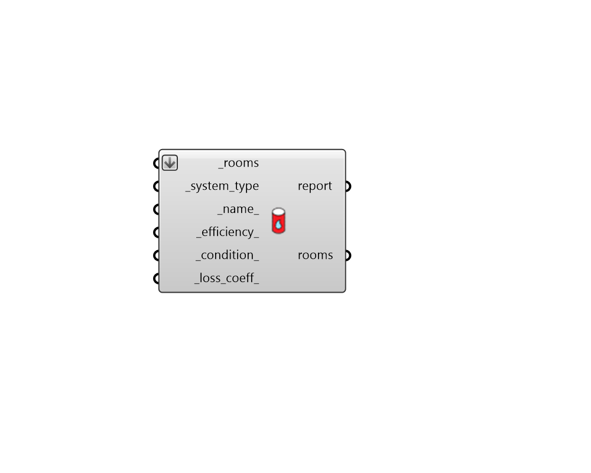

## SHW System

 - [[source code]](https://github.com/ladybug-tools/honeybee-grasshopper-energy/blob/master/honeybee_grasshopper_energy/src//HB%20SHW%20System.py)

Apply a template Service Hot Water (SHW) system to Honeybee Rooms. 

Note that the rooms must have hot water loads assigned to them in order for them to be connected to the system. 

#### Inputs
* ##### rooms [Required]
Honeybee Rooms to which the input template system will be assigned. This can also be a Honeybee Model for which all Rooms will be assigned the SHW system. 
* ##### system_type [Required]
Text for the specific type of service hot water system and equipment. The "HB SHW Templates" component has a full list of the supported system templates. 
* ##### name 
Text to set the name for the Service Hot Water system and to be incorporated into unique system identifier. If the name is not provided, a random name will be assigned. 
* ##### efficiency 
A number for the efficiency of the heater within the system. For Gas systems, this is the efficiency of the burner. For HeatPump systems, this is the rated COP of the system. For electric systems, this should usually be set to 1. If unspecified this value will automatically be set based on the equipment_type. See below for the default value for each equipment type: 

    * Gas_WaterHeater - 0.8

    * Electric_WaterHeater - 1.0

    * HeatPump_WaterHeater - 3.5

    * Gas_TanklessHeater - 0.8

    * Electric_TanklessHeater - 1.0
* ##### condition 
A number for the ambient temperature in which the hot water tank is located [C]. This can also be a Room in which the tank is located. (Default: 22). 
* ##### loss_coeff 
A number for the loss of heat from the water heater tank to the surrounding ambient conditions [W/K]. (Default: 6 W/K). 

#### Outputs
* ##### report
Script variable OSHVACSystems 
* ##### rooms
The input Rooms with a Service Hot Water system applied. 