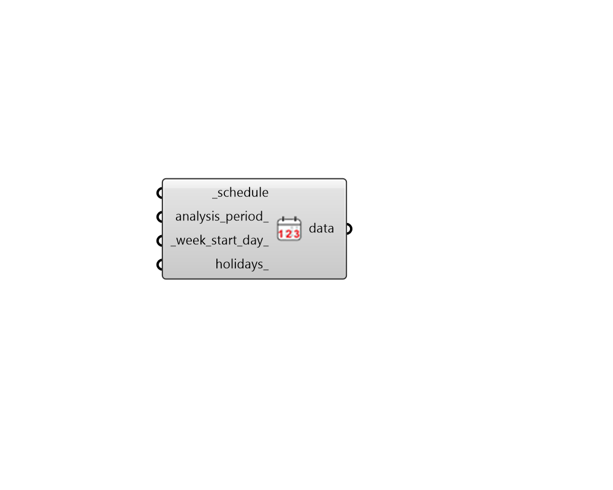

## Schedule to Data

 - [[source code]](https://github.com/ladybug-tools/honeybee-grasshopper-energy/blob/master/honeybee_grasshopper_energy/src//HB%20Schedule%20to%20Data.py)

Get a ladybug DataCollection representing this schedule at a given timestep. 

This DataCollection can be used to visualize timeseries schedule values over the entire period of a simulation using a component like the "LB Hourly Plot". 

This DataCollection can also be used in the crafting of conditional statements with the ladybug components. For example, making a psychrometric chart of zone temperature/humidity for only the hours that the occupancy schedule is above a certain threshold. 

#### Inputs
* ##### schedule [Required]
A ScheduleRuleSet or SchedileFixedInterval for which a DataCollection of timeseries schedule values will be produced. This can also be the identifier of a Schedule to be looked up in the schedule library. 
* ##### analysis_period 
An optional AnalysisPeriod to set the start and end datetimes of the resulting DataCollection. The timestep of this AnalysisPeriod will also be used to determine the timestep of the resulting DataCollection. 
* ##### week_start_day 
An optional text string to set the start day of the week of the schedule timeseries data. Default: Sunday. Choose from the following: 

    * Sunday

    * Monday

    * Tuesday

    * Wednesday

    * Thursday

    * Friday

    * Saturday
* ##### holidays 
An optional list of strings (eq: 25 Dec) to represent the holidays in the resulting timeseries. Holiday schedules will be used for these dates in the resulting timeseries. 

#### Outputs
* ##### data
A ladybug DataCollection representing the timeseries values of the schedule. This can be used to visualize timeseries schedule values over the entire period of a simulation using a component like the "LB Hourly Plot". 