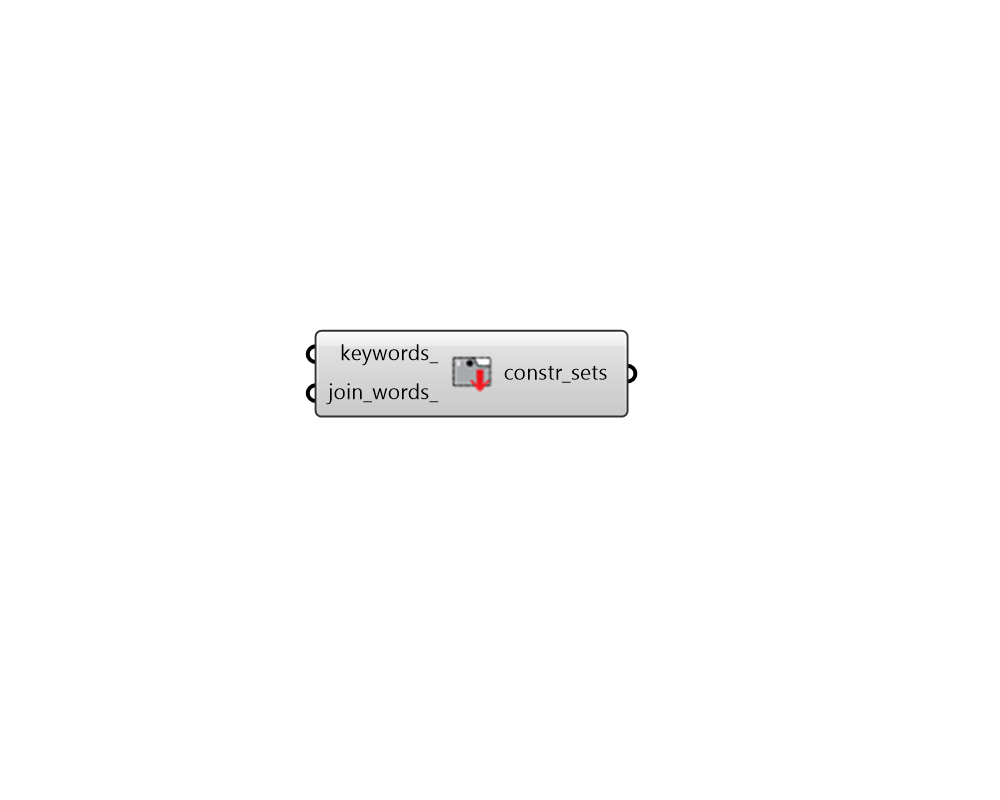

## Search Construction Sets

 - [[source code]](https://github.com/ladybug-tools/honeybee-grasshopper-energy/blob/master/honeybee_grasshopper_energy/src//HB%20Search%20Construction%20Sets.py)

Search for available ConstructionSets within the honeybee energy standards library. 

#### Inputs
* ##### keywords 
Optional keywords to be used to narrow down the output list of construction sets. If nothing is input here, all available construction sets will be output. 
* ##### join_words 
If False or None, this component will automatically split any strings of multiple keywords (spearated by spaces) into separate keywords for searching. This results in a greater liklihood of finding an item in the search but it may not be appropropriate for all cases. You may want to set it to True when you are searching for a specific phrase that includes spaces. (Default: False). 

#### Outputs
* ##### constr_sets
A list of ConstructionSet identifiers that can be applied to Honeybee Rooms. 