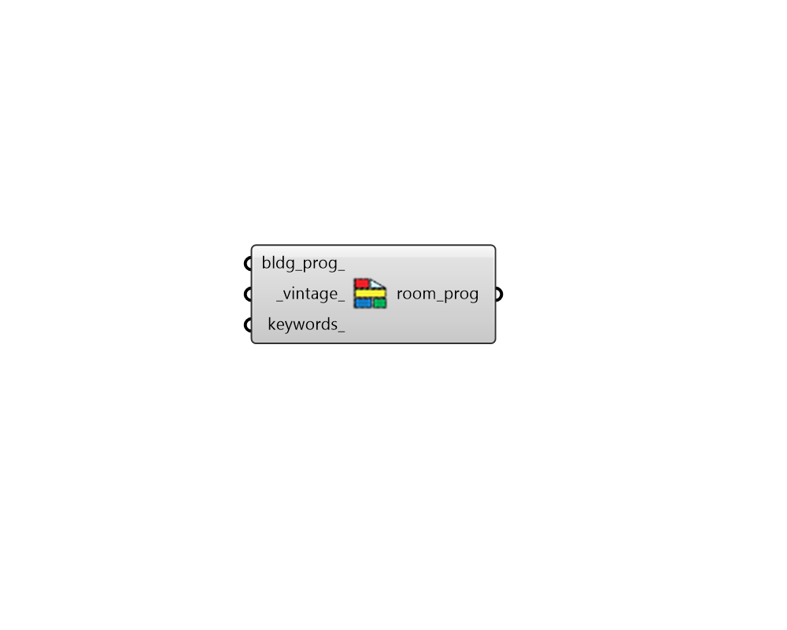

## Search Programs

 - [[source code]](https://github.com/ladybug-tools/honeybee-grasshopper-energy/blob/master/honeybee_grasshopper_energy/src//HB%20Search%20Programs.py)

Search for available ProgramTypes within the honeybee energy standards library. 

Note that the Room ProgramTypes output from this component effectively map to space types within OpenStudio. 

#### Inputs
* ##### bldg_prog 
Text for the building program to search (eg. "LargeOffice", "MidriseApartment", etc.). The Honeybee "Building Programs" component lists all of the building programs available in the library. If None, all ProgramTypes within the library will be output (filtered by keywords_ below). 
* ##### vintage 
Text for the building vintage to search (eg. "2013", "pre_1980", etc.). The Honeybee "Building Vintages" component lists all of the vintages available in the library. Default: "2013" (for ASHRAE 90.1 2013 | IECC 2015). Note that vintages are often called "templates" within the OpenStudio standards gem and so this property effective maps to the standards gem "template". 
* ##### keywords 
Optional keywords to be used to narrow down the output list of room programs. If nothing is input here, all available room programs will be output. 

#### Outputs
* ##### room_prog
A list of room program identifiers that meet the input criteria and can be applied to Honeybee Rooms. 