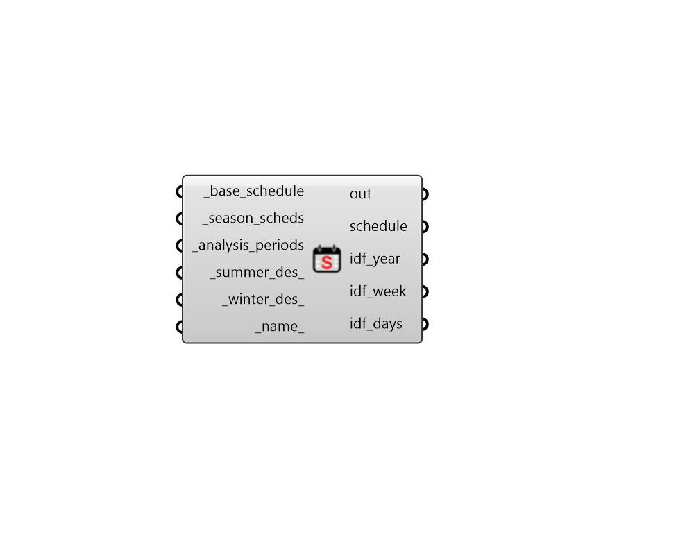

## Seasonal Schedule

 - [[source code]](https://github.com/ladybug-tools/honeybee-grasshopper-energy/blob/master/honeybee_grasshopper_energy/src//HB%20Seasonal%20Schedule.py)

Create a schedule using from other ScheduleRulesets and AnalysisPeriods over which each schedule should be applied. 

#### Inputs
* ##### base_schedule [Required]
A ScheduleRuleset that represents the base schedule on top of which the other _season_scheds will be applied. This can also be text to look up a ScheduleRuleset in the schedule library. Any time period that is not covered by the input _analysis_periods will default to this schedule. Furthermore, the summer and winter design day schedules will be taken from this schedule as well as the ScheduleTypeLimits. 
* ##### season_scheds [Required]
A list of ScheduleRulesets that align with the _analysis_periods below and represent the schedules that will be applied over the _base_schedule for the duration of the respective AnalysisPeriod. This can also be text to look up ScheduleRulesets in the schedule library. 
* ##### analysis_periods [Required]
A list of AnalysusPeriod objects that align with the _season_scheds and represent the time periods over which each season schedule should be applied. Note that, if these AnalysisPeriods overlap with one another, then the schedules that come later in this list will overwrite those that come earlier in the list for the duration of the overlapping time period. 
* ##### summer_des 
An optional list of 24 values that represent the schedule values at each hour of the summer design day. This can also be a single constant value for the whole day. If None, the summer design day schedule of the _base_schedule will be used. 
* ##### winter_des 
An optional list of 24 values that represent the schedule values at each hour of the summer design day. This can also be a single constant value for the whole day. If None, the summer design day schedule of the _base_schedule will be used. 
* ##### name 
Text to set the name for the Schedule and to be incorporated into a unique Schedule identifier. 

#### Outputs
* ##### out
Reports, errors, warnings, etc. 
* ##### schedule
A ScheduleRuleset object that can be assigned to a Room, a Load object, or a ProgramType object. 
* ##### idf_year
Text string for the EnergyPlus ScheduleYear that will ultimately be written into the IDF for simulation. This can also be used to add the schedule to the schedule library that is loaded up upon the start of Honeybee by copying this text into the honeybee/library/schedules/ user_library.idf file along with the other idf text outputs. 
* ##### idf_week
Text string for the EnergyPlus ScheduleWeek that will ultimately be written into the IDF for simulation. This can also be used to add the schedule to the schedule library that is loaded up upon the start of Honeybee by copying this text into the honeybee/library/schedules/ user_library.idf file along with the other idf text outputs. 
* ##### idf_days
Text strings for the EnergyPlus SchedulDays that will ultimately be written into the IDF for simulation. This can also be used to add the schedule to the schedule library that is loaded up upon the start of Honeybee by copying this text into the honeybee/library/schedules/ user_library.idf file along with the other idf text outputs. 