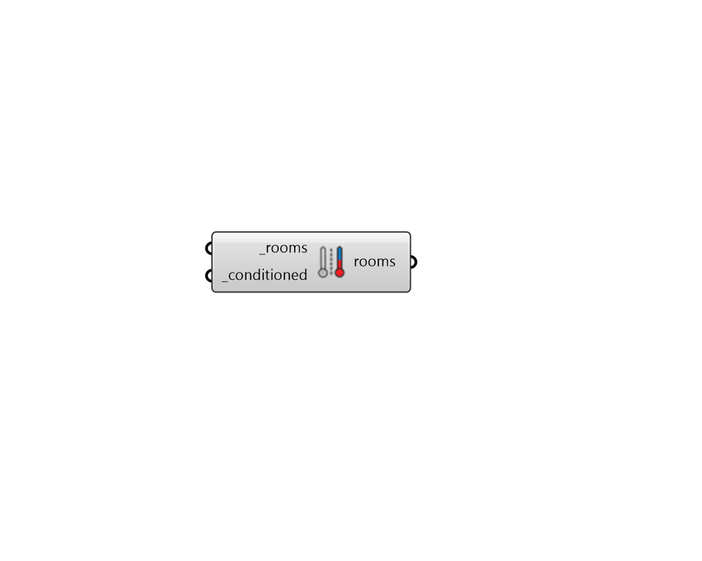

## Set Conditioned

 - [[source code]](https://github.com/ladybug-tools/honeybee-grasshopper-energy/blob/master/honeybee_grasshopper_energy/src//HB%20Set%20Conditioned.py)

Set Honeybee Rooms to be conditioned or unconditioned with a heating/cooling system. 

If _conditioned is True and the connected rooms are not currently conditioned, an Ideal Air System will be assigned to them. Otherwise, if they are already conditioned, the existing HVAC system will be left as it is. 

#### Inputs
* ##### rooms [Required]
Honeybee Rooms to have their conditioned property set. 
* ##### conditioned [Required]
Boolean to indicate whether the rooms are conditioned with a heating/cooling system. 

#### Outputs
* ##### rooms
Rooms that have had their interinal loads removed to reflect a plenum space. 