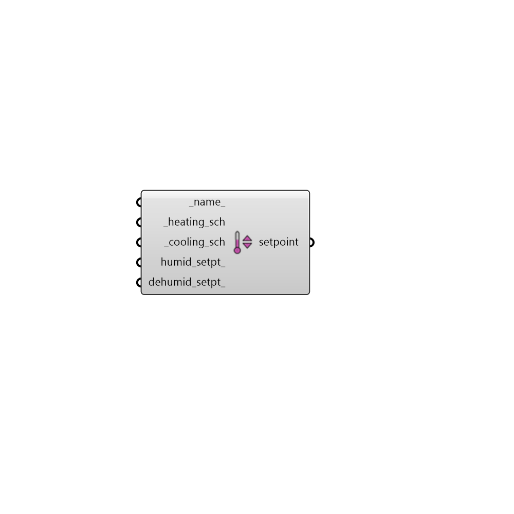

## Setpoint

 - [[source code]](https://github.com/ladybug-tools/honeybee-grasshopper-energy/blob/master/honeybee_grasshopper_energy/src//HB%20Setpoint.py)

Create a Setpoint object that can be used to create a ProgramType or be assigned directly to a Room. 

#### Inputs
* ##### name 
Text to set the name for the Setpoint and to be incorporated into a unique Setpoint identifier. If None, a unique name will be generated. 
* ##### heating_sch [Required]
A temperature schedule for the heating setpoint. The type limit of this schedule should be temperature and the values should be the temperature setpoint in degrees Celcius. 
* ##### cooling_sch [Required]
A temperature schedule for the cooling setpoint. The type limit of this schedule should be temperature and the values should be the temperature setpoint in degrees Celcius. 
* ##### humid_setpt 
A numerical value between 0 and 100 for the relative humidity humidifying setpoint [%]. This value will be constant throughout the year. If None, no humidification will occur. 
* ##### dehumid_setpt 
A numerical value between 0 and 100 for the relative humidity dehumidifying setpoint [%]. This value will be constant throughout the year. If None, no dehumidification will occur beyond that which is needed to create air at the cooling supply temperature. 

#### Outputs
* ##### setpoint
A Setpoint object that can be used to create a ProgramType or be assigned directly to a Room. 