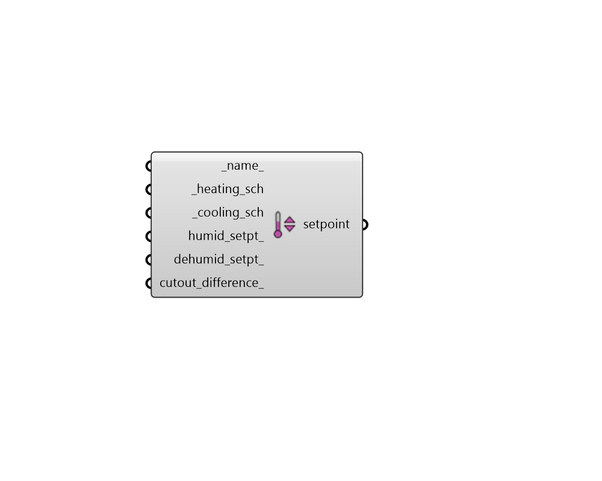

## Setpoint

 - [[source code]](https://github.com/ladybug-tools/honeybee-grasshopper-energy/blob/master/honeybee_grasshopper_energy/src//HB%20Setpoint.py)

Create a Setpoint object that can be used to create a ProgramType or be assigned directly to a Room. 

#### Inputs
* ##### name 
Text to set the name for the Setpoint and to be incorporated into a unique Setpoint identifier. If None, a unique name will be generated. 
* ##### heating_sch [Required]
A temperature schedule for the heating setpoint. The type limit of this schedule should be temperature and the values should be the temperature setpoint in degrees Celcius. 
* ##### cooling_sch [Required]
A temperature schedule for the cooling setpoint. The type limit of this schedule should be temperature and the values should be the temperature setpoint in degrees Celcius. 
* ##### humid_setpt 
A numerical value between 0 and 100 for the relative humidity humidifying setpoint [%]. This value will be constant throughout the year. If None, no humidification will occur. 
* ##### dehumid_setpt 
A numerical value between 0 and 100 for the relative humidity dehumidifying setpoint [%]. This value will be constant throughout the year. If None, no dehumidification will occur beyond that which is needed to create air at the cooling supply temperature. 
* ##### cutout_difference 
An optional positive number for the temperature difference between the cutout temperature and the setpoint temperature. Specifying a non-zero number here is useful for modeling the throttling range associated with a given setup of setpoint controls and HVAC equipment. Throttling ranges describe the range where a zone is slightly over-cooled or over-heated beyond the thermostat setpoint. They are used to avoid situations where HVAC systems turn on only to turn off a few minutes later, thereby wearing out the parts of mechanical systems faster. They can have a minor impact on energy consumption and can often have significant impacts on occupant thermal comfort, though using the default value of zero will often yield results that are close enough when trying to estimate the annual heating/cooling energy use. Specifying a value of zero effectively assumes that the system will turn on whenever conditions are outside the setpoint range and will cut out as soon as the setpoint is reached. (Default: 0). 

#### Outputs
* ##### setpoint
A Setpoint object that can be used to create a ProgramType or be assigned directly to a Room. 