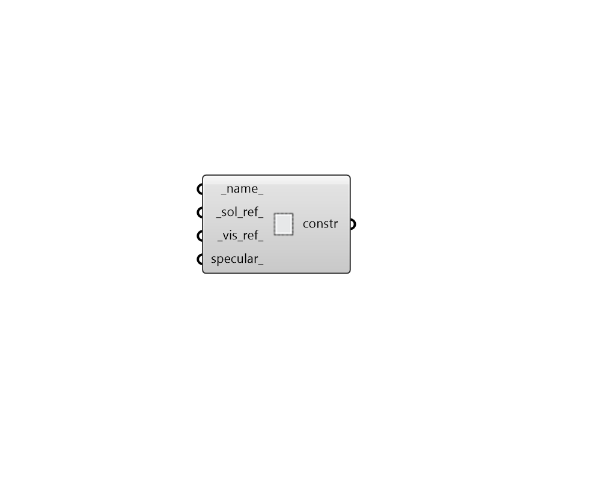

## Shade Construction

 - [[source code]](https://github.com/ladybug-tools/honeybee-grasshopper-energy/blob/master/honeybee_grasshopper_energy/src//HB%20Shade%20Construction.py)

Create an EnergyPlus shade construction. Note that Shade objects in EnergyPlus do not have layers and are only defined by their exterior reflectance. 

#### Inputs
* ##### name 
Text to set the name for the Construction and to be incorporated into a unique Construction identifier. 
* ##### sol_ref 
A number between 0 and 1 for the solar reflectance of the construction. Default: 0.2. 
* ##### vis_ref 
A number between 0 and 1 for the visible reflectance of the construction. Default: 0.2. 
* ##### specular 
A boolean to note whether the reflection off the shade should be diffuse (False) or specular (True). Set to True if the construction is representing a glass facade or a mirror material. Default: False. 

#### Outputs
* ##### constr
A shade construction that can be assigned to Honeybee Shades or ConstructionSets. 